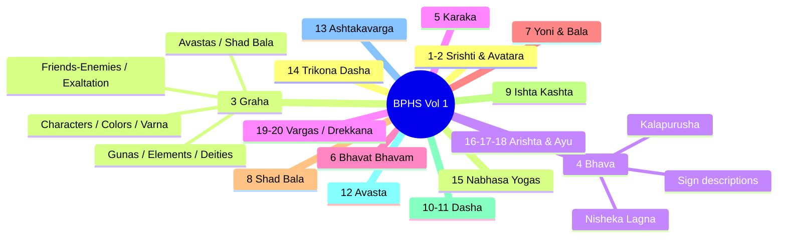
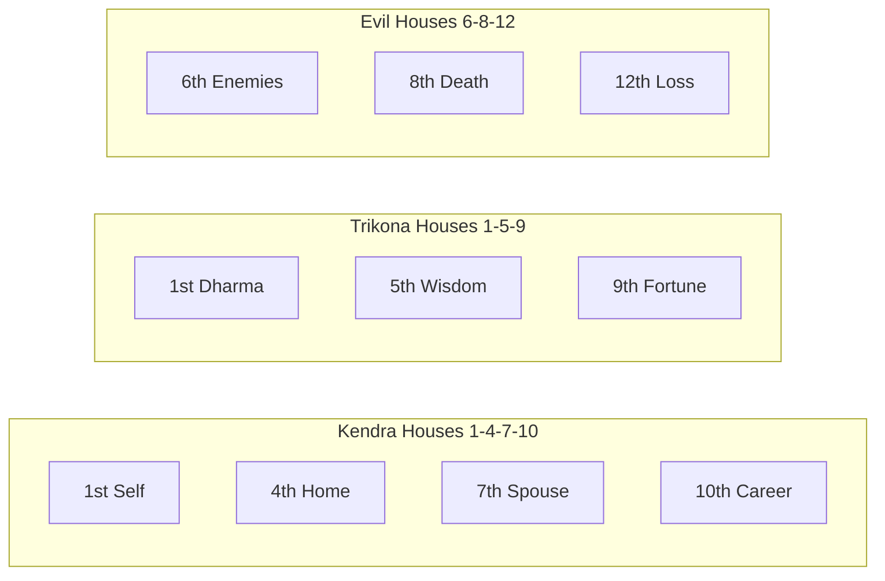

# Brihat Parasara Hora Sastra

> **Complete Reference Guide**
> Girish Chand Sharma Translation — Volume 1 (Chapters 1–20)
> Detailed descriptions, examples, and chart illustrations

---

## Volume 1 — Chapter Structure



---

## 1. Graha — Planet Details

### Planetary Cabinet (3.14-15)

> **Shloka 14-15**: The Sun and the Moon are of royal status and Mars is the army chief; Mercury is the prince apparent and Jupiter and Venus are the ministerial planets. Saturn is servant and Rahu and Ketu form the planetary army.

> **Example**: If strong Mars as Lord of 6th House forms relation with the 10th house, the native may rise to be a high officer in the army. If as Lord of 10th House he has relation with the Ascendant, the native will be patronised by military authorities. If the same planet is weak, difficulties and obstacles will be caused by these authorities.

### Significations (3.12-13)

| Graha | BPHS | Karakatva | Example / Explanation from Text |
|-------|------|-----------|-------------------------------|
| Sun | 3.12 | Soul (Atma) | If Sun is strong in horoscope, one will have a matured soul and will make abundant spiritual progress. The Vedas declare "Surya Atma Jagatah Tasthushashcha" — the Sun is the soul of all that exists. |
| Moon | 3.12 | Mind (Manas) | Moon or mind when strong gives life and strength as Moon acts as an ascendant. Most Yogas derive their value through the strength of the Moon — e.g. Chandradhi Yoga, Gaja Keshri Yoga. The Supreme can only be seen through a pure mind. |
| Mars | 3.12 | Strength | Mars is strength in every field of the body (muscular), in politics (armed forces), in psychology (intellect). Hence Mars is called 'Neta' — the General, the Military man. |
| Mercury | 3.13 | Speech | Significator of speech — proper, witty answer at proper time. If as Lord of 2nd House Mercury is strong and aspected by a benefic, and Jupiter is also strong, the native's eloquence impresses intellectuals. |
| Jupiter | 3.13 | Happiness & Knowledge | Significator of happiness. If Lord of 4th or aspects Lord of 4th and strong, native leads a happy life. Also significator of comprehensive knowledge — if Lord of 9th is strong and aspected by Jupiter, all-comprehensive knowledge. |
| Venus | 3.13 | Semen / Refinement | Most refined planet. Significator of semen (finest substance in body). If 7th House and Venus are strong, semen is strengthened. Reverse causes weakness and loss of reproductive ability. |
| Saturn | 3.13 | Grief | If Lord of evil houses or in fall, influences 4th House by aspect/conjunction, native is subject to much sorrow, grief and misery. Exalted Saturn conducive to philosophical thinking and longevity. |

### Planetary Cabinet & Government Influence

> **Example from Notes**: The strength of the Sun in a horoscope secures high position, promotion or financial gain from the favour of governmental authorities. If the Moon is strong, the native, due to favour and affection from the people, through election may rise to membership of municipality, Legislature, Parliament and may become even a minister.

### Complexions (3.16-17) — Application Example

| Graha | Color | Application |
|-------|-------|-------------|
| Sun | Blood-red | If Lord of Ascendant is Sun and he is in Ascendant not influenced by any planet, native's hue will be darkish blood-red. If Sun has aspect of Jupiter and Moon, darkishness diminishes to tawny-red. |
| Moon | Tawny | — |
| Mars | Blood-red, short stature | — |
| Mercury | Grass-green | — |
| Jupiter | Tawny | — |
| Venus | Variegated | — |
| Saturn | Dark | — |

### Sex of Planets (3.19) — Detailed Application

| Graha | Sex | Real-world Application |
|-------|-----|----------------------|
| Sun | Male | Manly qualities from Mars, Jupiter, Sun on Ascendant |
| Moon | Female | Womanly qualities from Venus, Moon on Ascendant |
| Mars | Male | More male children if these influence 5th House |
| Mercury | Neuter | Deficiency of sex qualities |
| Jupiter | Male | — |
| Venus | Female | Sister if influence 3rd/11th |
| Saturn | Neuter | Impotency if in 7th with Mercury and Venus afflicted |

> **Example from Text**: Date of birth 21.9.1952, 19:00 IST, Lat 28°43', Long 77°13'. Ascendant is Pisces. In 7th House: Mercury, Saturn, Sun, Venus, Moon. Venus is in fall with Mercury and Saturn (two neuters). Sun is Lord of 6th. Venus's sexual potency was completely destroyed — the native was impotent, causing divorce.
> 
> 

### Elements (3.20) — Practical Application

**Earth (Mercury)**: If dominant, native's teeth, skin, nails, hair are oily; odour oozes from body. Indicates Mercury Dasa. The native grows perfume-loving.

**Fire (Sun, Mars)**: Gives brilliance, honour, respect, vigour, success in aims.

**Sky/Ether (Jupiter)**: Quality is word/speech. Strong Jupiter confers sobriety, ability to speak enlightening words, good luck, generosity.

**Water (Moon, Venus)**: Ensures mothering for whole life, many well-wishers, no enmity, great popularity, success in every action.

**Air (Saturn)**: Makes body light, soft touch. Gives promotion, plain-speaking. Saturn in fall → defective air element → ugliness, dryness, disease, obstacles.

### Physical Descriptions (3.23-30)

| Graha | Shloka | Description |
|-------|--------|-------------|
| Sun | 3.23 | Honey-coloured eyes, square body, clean habits, bilious, intelligent, limited hair |
| Moon | 3.24 | Windy & phlegmatic, round body, learned, auspicious looks, sweet speech, fickle, lustful |
| Mars | 3.25 | Cruel, blood-red eyes, fickle-minded, liberal-hearted, bilious, thin waist, thin physique |
| Mercury | 3.26 | Attractive physique, pun-making ability, witty, humorous, pitta-vata |
| Jupiter | 3.27 | Large-bodied, honey-coloured eyes & hair, phlegmatic, intelligent, learned in all Shastras |
| Venus | 3.28 | Joyful, charming, beautiful brilliant eyes, poet, phlegmatic-windy, curly hair |
| Saturn | 3.29 | Emaciated & long physique, honey eyes, windy temperament, big teeth, indolent, lame, rough hair |
| Rahu | 3.30 | Smoke-like blue body, lives in forests, horrible, windy, intelligent |
| Ketu | 3.30 | Like Rahu |

### Primary Ingredients / Body Parts (3.31)

> **Shloka 31**: Bones (Sun), blood (Moon), marrow (Mars), skin (Mercury), fat (Jupiter), semen (Venus), muscles (Saturn)

> **Example — Bones (Sun)**: If Lagnesh is Sun in exaltation and strong, bones are strong with great calcium. If Sun is in fall, frequent fractures. If Sun related to Saturn, chronic bone disease like Bone T.B.
> 
> **Chart**: Born 19.10.1948, 2:15 IST, Lat 29°0', Long 77°45'. Sun in fall, aspected by Saturn (Lord of disease house). Native got several fractures and Bone T.B. Mercury conjunction caused frequency. Native is a teacher of physiology.
> 
> 

### Planetary Abodes (3.32)

| Graha | Governs |
|-------|---------|
| Sun | Temples, places of worship |
| Moon | Bathrooms, tanks, wells, seas, rivers |
| Mars | Kitchens, furnaces, fire-places |
| Mercury | Sport grounds, entertainment places |
| Jupiter | Banks, treasure houses |
| Venus | Bedrooms, sexual places |
| Saturn | Heaps of dirt, filth |

### Seasons / Ritu (3.33)

| Ritu | Months (Gregorian) | Sun Signs | Lunar Month |
|------|-------------------|-----------|-------------|
| **Shishir** (Winter) | Jan–Feb | Capricorn, Aquarius | Magh, Phalgun |
| **Basant** (Spring) | Mar–Apr | Pisces, Aries | Chaitra, Baisakh |
| **Greeshma** (Summer) | May–Jun | Taurus, Gemini | Jyeshta, Ashadha |
| **Varsha** (Rainy) | Jul–Aug | Cancer, Leo | Shravan, Bhadrapada |
| **Sharad** (Autumn) | Sep–Oct | Virgo, Libra | Ashwina, Kartika |
| **Hemant** (Pre-winter) | Nov–Dec | Scorpio, Sagittarius | Margh Shirsha, Pausa |

### Tastes (3.34)

| Graha | Taste | Effect on Native |
|-------|-------|-----------------|
| Sun | Pungent (Katu) | — |
| Moon | Saline (Lavana) | — |
| Mars | Bitter (Tikta) | — |
| Mercury | Mixed (Misra) | — |
| Jupiter | Sweet (Madhura) | — |
| Venus | Sour (Amla) | — |
| Saturn | Astringent (Kashaya) | Native's tastes follow the strong planet or the Dasa planet |

### Planetary Strengths — Digbala & Kala Bala (3.35-38)

**Shloka 35 — Digbala (Directional Strength)**:

| Direction | Strong Planets |
|-----------|---------------|
| **East** (Ascendant / 1st) | Mercury, Jupiter |
| **South** (Midheaven / 10th) | Sun, Mars |
| **West** (Descendant / 7th) | Saturn |
| **North** (Nadir / 4th) | Moon, Venus |

**Shloka 36-37 — Kala Bala (Temporal Strength)**:

| Factor | Strong Planets |
|--------|---------------|
| **Night** | Moon, Mars, Saturn |
| **Day** | Sun, Venus, Jupiter |
| **Both** | Mercury |
| **Krishna Paksha** (Dark fortnight) | Malefics |
| **Shukla Paksha** (Bright fortnight) | Benefics |
| **Saumyayana** (Northern course of Sun) | Benefics |
| **Yamayayana** (Southern course of Sun) | Malefics |

**Shloka 38 — Relative strength**: Lords of year > month > day > hora (planetary hour) in ascending order. Among planets: Saturn > Mars > Mercury > Jupiter > Venus > Moon > Sun in ascending order.

> **Note on Digbala**: A planet in its directional house benefits the native in that direction during its Dasa/Antardasa. E.g., Saturn in 7th (West) → favorable for Western commercial activities in Saturn periods.

### Relation of Planets to Trees (3.39-40)

| Graha | Trees |
|-------|-------|
| Sun | Strong, tall trees with stout trunks |
| Moon | Milky trees (rubber-yielding, latex) |
| Mars | Bitter ones (lemon plants, citrus) |
| Mercury | Fruitless trees |
| Jupiter | Fruitful trees |
| Venus | Floral plants, flowering shrubs |
| Saturn | Useless thorny trees, brambles |

### Caste, Cloth & Metal (3.41-44)

| Graha | Caste | Cloth | Metal / Gem | Abode |
|-------|-------|-------|-------------|-------|
| Sun | — | Red silken | — | — |
| Moon | — | White silken | — | — |
| Mars | — | Red | — | — |
| Mercury | — | Black silken | — | — |
| Jupiter | — | Saffron | — | — |
| Venus | — | Silken | — | — |
| Saturn | — | Multicoloured | — | Anthills |
| Rahu | Outcaste | Multicoloured | Lead | Anthills |
| Ketu | Mixed caste | Rags (hole-ridden) | Blue gem | Anthills |

> **Note**: Planets cause profit in their Dasa/Antardasa through clothes related to them — the native may favor wearing colours matching the ruling planet.

### Exaltation, Debilitation & Moolatrikona (3.49-54)

| Graha | Uccha | Deg | Neecha | Deg | Moolatrikona | Own House |
|-------|-------|-----|--------|-----|-------------|-----------|
| Sun | Aries | 10° | Libra | 10° | Leo 0-20° | Leo 20-30° |
| Moon | Taurus | 3° | Scorpio | 3° | Taurus 3-30° | Cancer |
| Mars | Capricorn | 28° | Cancer | 28° | Aries 0-12° | Aries 12-30°, Scorpio |
| Mercury | Virgo | 15° | Pisces | 15° | Virgo 15-20° | Virgo 20-30°, Gemini |
| Jupiter | Cancer | 5° | Capricorn | 5° | Sagittarius 0-10° | Sagittarius 10-30°, Pisces |
| Venus | Pisces | 27° | Virgo | 27° | Libra 0-15° | Libra 15-30°, Taurus |
| Saturn | Libra | 20° | Aries | 20° | Aquarius 0-20° | Aquarius 20-30°, Capricorn |

### Natural Relationships (3.55) — Derivation Example

**Method**: From the Moolatrikona sign of a planet, count the 2nd, 4th, 5th, 8th, 9th, 12th — these lords are friends. The rest (3rd, 6th, 7th, 10th, 11th) are enemies.

**Example — Sun's friends**: Sun's Moolatrikona = Leo. 4th = Scorpio (Mars) → friend. 2nd = Virgo (Mercury) but 2nd sign of Mercury = Gemini = 11th from Leo = enemy → Mercury is Neutral. 3rd = Libra (Venus), 2nd sign of Venus = Taurus = 10th from Leo = enemy → Venus is enemy.

| Planet | Friends | Neutrals | Enemies |
|--------|---------|----------|---------|
| Sun | Moon, Mars, Jupiter | Mercury | Venus, Saturn |
| Moon | Sun, Mercury | Mars, Jupiter, Venus, Saturn | — |
| Mars | Sun, Moon, Jupiter | Mercury | Venus, Saturn |
| Mercury | Sun, Venus | Mars, Jupiter, Saturn | Moon |
| Jupiter | Sun, Moon, Mars | Mercury | Venus, Saturn |
| Venus | Mercury, Saturn | Moon, Sun | Mars, Jupiter |
| Saturn | Mercury, Venus | Moon, Mars | Sun, Jupiter |
| Rahu | Jupiter, Venus, Saturn | Mercury | Sun, Moon, Mars |
| Ketu | Mars, Venus, Saturn | Mercury, Jupiter | Sun, Moon |

### 5-Fold Relationship (3.57-58)

| Natural | Temporary | Net Result |
|---------|-----------|------------|
| Friend | Friend | Extreme Friend |
| Friend | Neutral | Friend |
| Neutral | Friend | Friend |
| Enemy | Enemy | Extreme Enemy |
| Neutral | Enemy | Enemy |
| Enemy | Neutral | Enemy |
| Friend | Enemy | Neutral |
| Enemy | Friend | Neutral |

**Chart Example (p.51)**: Mercury, Venus, Ketu in 12th from Sun → temporary enemies. Jupiter, Mars in 2nd from Sun → temporary friends.

Compound result for Sun: Mars & Jupiter = extreme friends (friend naturally + friend temporarily). Moon = neutral (friend naturally + enemy temporarily). Mercury = enemy (neutral naturally + enemy temporarily). Venus & Saturn = extreme enemies (enemy naturally + enemy temporarily).

### Temporary (Tatkalika) Relationship Table (p.50)

Planets in 10th, 4th, 11th, 3rd, 2nd or 12th from another = mutual friends. Other placements = enemies.

| From | Friend | Neutral | Enemy |
|------|--------|---------|-------|
| Mercury | Moon | Mercury | Jupiter, Jupiter |
| Mercury | Jupiter | Venus | Mars, Moon |
| Mars | Rahu | Saturn | Mercury, Mercury, Mercury |
| Jupiter | Rahu | Jupiter | Venus |
| Venus | Ketu | Venus | Saturn |

### Astangata — Planetary Combustion

A planet is **combust** (astangata) when it is too close to the Sun and thus loses its splendour and strength. A combust planet behaves like a malefic, giving weak or adverse results.

| Planet | Combustion distance from Sun | Special rule |
|--------|:---------------------------:|--------------|
| Moon | 12° | — |
| Mars | 17° | — |
| Mercury | 14° | 12° when retrograde |
| Jupiter | 11° | — |
| Venus | 9° | — |
| Saturn | 15° | — |
| Rahu / Ketu | Always combust (shadow planets) | — |

**Effects**:
- Combust planet loses its ability to give full results — functions as if debilitated or weak
- A benefic planet when combust loses its benefic nature
- A malefic planet becomes more malefic
- The closer the planet is to the Sun (within 1°–2°), the more severe the combustion
- At the edge of the combustion zone, effects are proportionally weaker

**Exceptions**:
- Mercury when **retrograde** has a reduced combustion range (12°) — it is not fully combust in the outer part of the zone
- A planet in **exaltation** or **own sign** mitigates combustion effects somewhat
- If the planet is in the same sign as the Sun but beyond the combustion degree, it is said to be *under the Sun's beams* — weaker effect than full combustion

### Graha Drishti — Planetary Aspects

All planets aspect the **7th house** from themselves (full aspect). Three planets have **special aspects**:

| Planet | Aspects |
|--------|---------|
| All planets | 7th |
| Mars | 4th, 7th, 8th |
| Jupiter | 5th, 7th, 9th |
| Saturn | 3rd, 7th, 10th |
| Rahu | 5th, 7th, 9th (like Jupiter) |
| Ketu | 5th, 7th, 9th (like Jupiter) |

### Rasi Drishti — Sign Aspects

Signs aspect other signs based on their nature (movable, fixed, dual):

| Sign Nature | Aspects |
|-------------|---------|
| **Movable** (Aries, Cancer, Libra, Capricorn) | Fixed signs at **5th, 8th, 11th** from itself (excludes adjacent fixed sign) |
| **Fixed** (Taurus, Leo, Scorpio, Aquarius) | Movable signs at **4th, 7th, 10th** from itself (excludes adjacent movable sign) |
| **Dual** (Gemini, Virgo, Sagittarius, Pisces) | Other dual signs at **4th, 7th, 10th** from itself |

Additionally, **every sign aspects its 7th sign**.

**Example**: Asc = Aries (movable) with Sun & Venus. Aspect fixed signs at 5th (Leo), 8th (Scorpio), 11th (Aquarius), but NOT Taurus (adjacent fixed sign). Planets in those signs (Moon & Rahu in Leo, Ketu in Aquarius) are also aspected.

Taurus (fixed) with Mercury & Mars. Aspect movable signs at 4th (Cancer), 7th (Libra), 10th (Capricorn), but NOT Aries (adjacent movable). Planet Saturn in Cancer is aspected.

Gemini (dual) with Jupiter. Aspects other dual signs at 4th (Virgo), 7th (Sagittarius), 10th (Pisces), but NOT Gemini itself.

---

## 2. The 12 Bhavas — Detailed Significations



### 1st House — Tanu Bhava

**Shloka (Ch. 25)**: Physique, appearance, intellect, complexion, vigour, weakness, joy, sorrow, innate nature.

### 2nd House — Dhana Bhava

**Shloka**: Wealth, grains/food, family, enemies, metals, precious stones.

### 3rd House — Sahaja Bhava

**Shloka**: Valour, servants/attendants, brothers & sisters, initiatory instructions, journeys, parents' death.

### 4th House — Bandhu Bhava

**Shloka**: Conveyance, relatives, mother, happiness, treasure, lands, buildings.

### 5th House — Putra Bhava

**Shloka**: Amulets, sacred spells, learning, splendour of intellect, sons, ability to manage affairs, falling from position.

### 6th House — Shatru Bhava

**Shloka**: Doubt about death of maternal uncle, enemies, ulcers/wounds, step-mother.

### 7th House — Yuvati Bhava

**Shloka**: Wife, journey, trade, something vanished/stolen away, sexual matters.

> **Horary application**: If Lord of Ascendant is in 7th and Lord of 7th occupies Ascendant, native gets back the stolen thing.

### 8th House — Randhra Bhava

**Shloka**: Longevity, battle, enemies, forts, wealth of the dead, knowledge of past and future lives.

> **Alternate reading**: Borrowing/lending, diseases of anus (piles, fistula), knowledge of past/future lives, movement of jivatma after death.

### 9th House — Dharma Bhava

**Shloka**: Fortunes, wife's brother, religion, brother's wife, pilgrimages, visits to sacred places.

> **Logic**: 9th = 3rd from 7th (wife's brother) = 7th from 3rd (brother's wife).

### 10th House — Karma Bhava

**Shloka**: Royalty/authority, profession (unstable livelihood), honour, father, living in foreign lands, debts.

### 11th House — Labha Bhava

**Shloka**: Receipt of various articles, son's wife, income, gains.

### 12th House — Vyaya Bhava

**Shloka**: Expenses, knowledge about the enemy, loss.

### Bhava Names & Significator Analysis (Ch. 4, 39-43)

The 12 houses have specific names that indicate what each governs:

| # | Sanskrit | Meaning |
|:-:|----------|---------|
| 1 | Tanu | Physique, body |
| 2 | Dhan | Wealth |
| 3 | Sahaja | Younger sibling |
| 4 | Bandhu | Social relations, brotherhood |
| 5 | Putra | Progeny |
| 6 | Ari | Enemies |
| 7 | Yuvati | Spouse (wife) |
| 8 | Randhra | Span of life |
| 9 | Dharma | Religion |
| 10 | Karma | Livelihood |
| 11 | Labha | Gains |
| 12 | Vyaya | Expenditure |

**Significator-based house analysis (39-43)**:
- **Father**: 9th from Asc + 9th from **Sun**
- **10th & 11th** matters: also from **Sun**
- **1st, 4th, 2nd, 9th, 11th** matters: also from **Moon** (Chandra Lagna)
- **3rd** (younger sibling): also from **Mars** (take Mars as Asc)
- **6th** (enemies): also from **Mercury**
- **Progeny (5th)**: also from **Jupiter** (5th from Jupiter)
- **Spouse (7th)**: also from **Venus** (7th from Venus)
- **Death/longevity (8th)**: also from **6th from Saturn**
- **Expenditure (12th)**: also from **12th from Saturn**
- Every house's effects should also be judged from its **house lord**

---

## 3. Arishta (Evil) & Antidotes

### Balarishta (Childhood Death) Combinations (Ch. 16)

| Sloka | Combination | Effect |
|-------|-------------|--------|
| 3-6 | Moon in 6th/8th/12th aspected by malefics | Death soon; in 8th year if aspected by benefics |
| 3-6 | Ascendant not aspected by benefic | Child dies within a month |
| 5 | Malefics in 5th House | Mother's and brother's death |
| 6 | Mars in Ascendant with Sun or Saturn, no benefic aspect | Immediate death |
| 7-11 | Rahu with Sun & Moon, Mars & Saturn aspect Ascendant | Child doesn't live a week |
| 7-11 | Saturn in 10th, Moon in 6th, Mars in 7th | Child dies with mother |
| 7-11 | Saturn in Lagna, Moon in 8th, Jupiter in 3rd | Goes to Yama soon |
| 7-11 | Sun in Lagna or 9th, Saturn in 7th, Jupiter & Venus in 11th | Lives only a month |
| 12 | Moon with malefic in 9th/7th/Asc, no benefic aspect | Death source |
| 15 | All malefics in Eastern half, all benefics in Western, Scorpio Lagna | Death, no rethinking needed |
| 16 | Malefics in 12th & 6th or 8th & 2nd, Asc between malefics | Certain death |
| 18 | Decreasing Moon in Asc, malefics in Kendra & 8th | Immediate death |
| 22 | Malefic in rising Drekkana & 7th, decreasing Moon in Asc | Life taken soon |
| 23 | All planets devoid of strength in Apoklima (3-6-9-12) | Life of 6 months or 2 months |

### Evils to Mother (3.24-33)

| Sloka | Combination | Effect |
|-------|-------------|--------|
| 24 | Moon aspected by 3 malefics | Mother's destruction |
| 25 | Rahu, Mercury, Venus, Saturn, Sun in 2nd | Mother's death, child born posthumously |
| 27 | Sun exalted or debilitated in 7th | Child lives on goat's milk (Aries/Libra Asc) |
| 28 | Malefic in 4th from Moon, inimical sign, angle, no benefic | Mother's death |
| 30 | Malefics in Asc/7th/12th, Mercury in 2nd | Family destroyed |

> **Example for 3.30**: Born 23/24-2-1929, 3:15am, Lat 29°. Lagna Sagittarius. Saturn in Lagna, Mars in 7th, Ketu in 12th. Mercury in 2nd. Native passed childhood at maternal uncle's as family members died. He had no issue. Wife died 11 years after marriage. Second wife lived 3 years. He became an ascetic in Vivekananda Matha.
> 
> 

| Sloka | Combination | Effect |
|-------|-------------|--------|
| 33 | Saturn & Mars at 1° from each other, in Kendra from Moon | Child won't survive |

> **Example for 3.33**: Born 14.2.1984, 6:30am. Saturn and Mars in same degree and Navamsha. Mother died just after delivery. Native died on 13.5.1984.
> 
> 

### Antidotes to Evils (Ch. 17)

| Sloka | Combination | Antidote |
|-------|-------------|----------|
| 2 | One of Mercury, Jupiter, Venus in Kendra | Destroys all evils |
| 3 | Single strong Jupiter in Lagna | Destroys all evils (like obeisance to Shiva destroys sins) |
| 4 | Strong Ascendant Lord in Kendra | Capability to destroy all evils |
| 5 | Shukla Paksha night birth + benefic aspect on Asc; or Krishna Paksha day birth + benefic aspect | Destroys all evils |
| 6 | Libra Asc, Sun in 12th | Long life |
| 7 | Mars + Jupiter together or Mars aspected by Jupiter | Auspicious for mother |
| 8-9 | Malefics hemmed by benefics, benefics in Kendra/Trikona | Destroys evils |

---

## 4. Bhava Phala — House-wise Effects

### 7th House Effects (Ch. 27)

**Marriage Timing** (Sloka 22-34):

| Sloka | Combination | Marriage Age |
|-------|-------------|--------------|
| 22 | 7th Lord in benefic sign, Venus exalted/own sign | Generally married in youth |
| 23 | Sun in 7th, 7th Lord with Venus | 7th year |
| 24 | Venus in 2nd, 7th Lord in 11th | 11th year |
| 25 | Venus in Kendra, Asc Lord in Saturn's sign | Generally |
| 26 | Venus in Kendra, Saturn 7th from Venus | 12th or 19th |
| 27 | Venus 7th from Moon, Saturn 7th from Venus | — |
| 28 | 2nd Lord in 11th, Asc Lord in 7th | 15th year |
| 29 | 2nd & 11th Lords exchange | 16th year |
| 30 | Venus 7th from 8th (2nd from Asc), 2nd Lord with Mars | 22nd or 27th |
| 31 | Asc Lord in Navamsha of 7th, 7th Lord in 12th | 23rd or 26th |
| 32 | 8th Lord in 7th, Venus in Asc Navamsha | 25th or 33rd |
| 33 | Venus 9th from 9th (5th from Asc), Rahu in 5th or 9th | 31st or 33rd |
| 34 | Venus in 3rd, 7th Lord in 9th | 30th or 27th |

**Wife's Death** (Sloka 35-42):

| Sloka | Combination | Year |
|-------|-------------|------|
| 35-39 | 7th Lord debilitated, Venus in 6th/8th | 18th or 33rd |
| 35-39 | 7th Lord in 8th, 12th Lord in 7th | 19th |
| 35-39 | Rahu in 2nd, Mars in 7th | Day of marriage or 3rd day (snake bite) |
| 35-39 | Venus in 8th, 8th Lord in Saturn's sign | 12th or 19th |
| 35-39 | Asc Lord debilitated, 2nd Lord in 8th | — |
| 42 | Mars in 6th, Rahu in 7th, Saturn in 8th | Wife does not live (Paapkrittari yoga) |

**Sexual Nature** (Sloka 3-9):

| Sloka | Combination | Effect |
|-------|-------------|--------|
| 3 | Venus in 7th | Excessively lustful |
| 3 | Venus with malefic in any house | Loss of virility |
| 7-8 | Sun in 7th | Company of barren women |
| 7-8 | Moon in 7th | Wife of nature of the sign |
| 7-8 | Mars in 7th | Company of menstruating/barren woman |
| 7-8 | Mercury in 7th | Friendship with harlot/low caste woman |
| 7-8 | Jupiter in 7th | Relation with Brahmin's wife/pregnant woman |
| 7-8 | Saturn/Rahu/Ketu in 7th | Relation with base woman |
| 9 | Mars in 7th | Wife with attractive breasts |
| 9 | Saturn in 7th | Sickly, weak wife |
| 9 | Jupiter in 7th | Hard, prominent breasts |
| 9 | Venus in 7th | Attractive breasts |
| 10-13 | Malefics in 12th & 6th, weak Moon in 5th | Henpecked husband |
| 10-13 | Saturn or Mars in 7th | Wife unfaithful/harlot |
| 10-13 | Venus in Mars' Navamsha/sign or with Mars | Native disposed to kiss wife's private parts |
| 10-13 | Venus in Saturn's Navamsha/sign or with Saturn | Homosexual tendency |

### 8th House — Longevity (Ch. 27)

| Sloka | Combination | Effect |
|-------|-------------|--------|
| 1 | 8th Lord in Kendra | Long life |
| 2 | 8th Lord with malefic in 8th, Asc Lord also there | Short life |
| 3 | Saturn + 10th Lord in 8th with malefic | Short life |
| 4-7 | 6th/12th Lord in 6th/12th or Asc/8th | Long life |
| 4-7 | 5th/Asc/8th Lord in own sign/Navamsha/friend's house | Long life |
| 8-13 | 8th Lord in Kendra, weak Asc Lord | 20-32 years |
| 8-13 | 8th Lord debilitated, malefic in 8th, weak Asc Lord | Short life |
| 14-15 | Asc Lord exalted, Moon in 11th, Jupiter in 8th | Long life |

> **Example for short life (8.2)**: Asc Lord Mars in 8th with 8th Lord Mercury and Sun, aspected by Saturn. Child could not live.

> **Example for short life (8.3)**: Saturn with 8th Lord Moon in 8th, Mars also in 8th. Native lived only a short time.

### 9th House — Fortune (Ch. 27)

| Sloka | Combination | Effect |
|-------|-------------|--------|
| 1 | Strong 9th Lord in 9th | Fortunate |
| 2 | Jupiter in 9th, 9th Lord in angle, strong Asc Lord | Extremely fortunate |
| 3 | Strong 9th Lord, Venus in 9th, Jupiter in angle | Father fortunate |
| 4 | Mars in 10th/12th, 9th Lord debilitated | Father indigent |
| 5 | 9th Lord highly exalted, Jupiter in 9th Navamsha + angle | Father long-lived |
| 8-9 | Sun exalted, 9th Lord in 11th | Religious, devoted to father |
| 10 | 9th Lord in 2nd, 2nd Lord in 9th | Fortune, conveyances, fame at 32 |
| 11 | Asc Lord + 6th Lord in 9th | Father-son enmity |
| 12 | 10th & 3rd Lords weak, 9th Lord debilitated/combust | Beggar |
| 13-25 | Various father's death combinations | 1st-50th year based on combinations |
| 27-28 | Jupiter in 8th, 9th Lord in angle | Abundant wealth |
| 29 | Asc Lord in 9th, 9th Lord in Asc, Jupiter in 7th | Wealth & fortune |

### 10th House — Career (Ch. 28)

| Sloka | Combination | Effect |
|-------|-------------|--------|
| 2 | Strong 10th Lord in exaltation/Navamsha/own sign | Paternal happiness, fame, good deeds |
| 3 | 10th Lord devoid of strength | Obstructions in work |
| 3 | Rahu in angle or trine | Performs Jyotishtoma Yajna |
| 4 | 10th Lord with benefic in benefic house | Gain through royal patronage & business |
| 5 | 10th & 11th occupied by malefics | Bad deeds, bad name |
| 6 | 10th Lord with Rahu in 8th | Averse to people, fool, wicked |
| 7 | 10th Lord + Saturn + Mars in 7th, 7th Lord with malefic | Carnal pleasures, sense-gratification |
| 8-10 | 10th Lord exalted with Jupiter, 9th Lord in 10th | Honour, wealth, valour |
| 11 | Sun + Rahu + Mars + Saturn in 11th | Failure in endeavours |
| 12 | Jupiter + Venus in Pisces, strong Asc Lord, Moon exalted | Learned, wealthy, enlightened |
| 16 | Saturn + debilitated planet in 10th, malefic in 10th Navamsha | Bereft of actions |
| 17 | 10th Lord in 8th, 8th Lord in 10th with malefic | Cruel, wicked |

### 11th House — Gains (Ch. 28)

| Sloka | Combination | Effect |
|-------|-------------|--------|
| 2 | 11th Lord in 11th/angle/trine/exalted even if combust | Many gains |
| 3 | 11th Lord in 2nd, 2nd Lord in angle, Jupiter in 11th | Gains through various means |
| 4 | 11th Lord in 3rd, benefic in 11th | Gain of 2000 Nishkas at 36 |
| 5 | 11th Lord with benefic in 5th | 500 Nishkas at 40 |
| 6 | Jupiter in 11th, Moon in 2nd, aspect on 9th | 6000 Nishkas |
| 7 | Jupiter + Mercury + Moon in 9th | Wealth, grains, fortunes, diamonds |
| 8 | 11th Lord in Asc, Asc Lord in 11th | 1000 Nishkas |
| 9 | 2nd Lord in 11th, 11th Lord in 2nd (exchange) | Rise after marriage |
| 10 | 3rd Lord in 11th, 11th Lord in 3rd | Gains through brothers, divine ornaments |
| 11 | 11th Lord debilitated/combust/in 6th/8th/12th with malefic | No gains despite effort |

### 12th House — Expenditure (Ch. 28)

| Sloka | Combination | Effect |
|-------|-------------|--------|
| 1-4 | 12th Lord with benefic, own/exalted sign | Expenses on good accounts |
| 1-4 | Moon as 12th Lord in 9th/11th/5th, exalted/own | Beautiful houses, beds, scented articles |
| 5-6 | 12th Lord in enemy Navamsha/debilitation/8th Navamsha/6th/8th | Deprived of marital happiness |

> **Example (12th House)**: Born 3.11.1956, 6:45am, Hapur. Libra Asc. Venus in 12th in debilitation. 12th Lord Mercury in Asc but debilitated Navamsha, with Sun in debilitation. 12th House aspected by Mars. Jupiter (3rd & 6th Lord) in 12th. Native was married but...
> 
> 

---

## 5. Yogas

### Raja Yogas

Raja Yoga occurs when Lord of a Kendra (1, 4, 7, 10) joins Lord of a Trikona (1, 5, 9) in a Kendra or Trikona.


### Vipareeta Raja Yoga

Lords of 6th, 8th, or 12th in each other's houses or in Kendra/Trikona = rise after fall.

### Dhana Yogas

| Type | Condition |
|------|-----------|
| 1st | 1st Lord + 2nd Lord in 2nd or 11th |
| 2nd | 5th Lord + 9th Lord in 2nd or 11th |
| 3rd | 11th Lord strong in own sign |
| 4th | 1st Lord in 11th, 11th Lord in 1st |

### Gajakesari Yoga

Jupiter in Kendra (1, 4, 7, 10) from Moon → wisdom, wealth, fame.

### Budha-Aditya Yoga

Sun + Mercury in same sign → intelligence, eloquence.

### Neecha Bhanga

Debilitated planet gets cancellation if:
- Lord of debilitation sign is in Kendra from 1st or Moon
- Debilitated planet in exaltation Navamsha
- Benefic planet aspects or joins the debilitated planet

### Nabhasa Yogas (32 Yogas)

**Akriti (Shape) Yogas**:

| Yoga | Condition | Effect |
|------|-----------|--------|
| Rajju | 3-4 planets in movable/fixed/dual signs | Traveller |
| Musala | All planets in one group (movable/fixed/dual) | Wealthy, generous |
| Nala | All planets in 2-3-4 signs | Rich, famous |
| Mala | All planets in 1-4 signs | Poor, suffering |
| Sarpa | Planets in 1-2-3-4 with empty signs between | Timid, poor |
| Gada | All planets in 2 adjacent quadrants | — |
| Sakata | Planets in 1-4-7-10 (cart shape) | — |
| Vihanga | Planets in 6-7-8 (bird shape) | — |
| Vajra | Planets in Kendras + Panaparas | — |
| Kamala | All planets in Kendra | — |

**Sankhya (Number) Yogas**:

| Planets | Yoga | Effect |
|---------|------|--------|
| 1 | Gola | Indifferent |
| 2 | Yuga | Modest |
| 3 | Sula | Disease |
| 4 | Kendra | Renunciation |
| 5 | Vikala | Good |
| 6 | Dama | Philanthropist |

### Chandra Yogas

| Yoga | Condition |
|------|-----------|
| Sunapha | Benefic in 2nd from Moon |
| Anapha | Benefic in 12th from Moon |
| Durudhura | Benefics in 2nd + 12th from Moon |

---

## 6. Kalapurusha & Rasi Descriptions

### Body of Eternal Time

| Sign | Part | Nature | Element | Varna | Guna | Strong |
|------|------|--------|---------|-------|------|--------|
| Aries | Head | Movable, Male, Cruel | Fire | Kshatriya | Rajoguni | Night |
| Taurus | Face | Fixed, Female, Benefic | Earth | Vaishya | Rajoguni | Night |
| Gemini | Arms | Dual, Male, Cruel | Air | — | — | Night |
| Cancer | Heart | Movable, Female, Benefic | Water | Brahmin | Sattwika | Night |
| Leo | Stomach | Fixed, Male, Cruel | Fire | Kshatriya | Sattwika | Day |
| Virgo | Hip | Dual, Female, Benefic | Air | Vaishya | Tamoguni | Day |
| Libra | Below navel | Movable, Male, Cruel | — | Shudra | Rajoguni | Day |
| Scorpio | Private parts | Fixed, Female, Benefic | — | Brahmin | — | Day |
| Sagittarius | Thighs | Dual, Male, Cruel | Fire | Kshatriya | Sattwika | Night |
| Capricorn | Knees | Movable, Female, Benefic | Earth | — | Tamoguni | Night |
| Aquarius | Ankles | Fixed, Male, Cruel | Air | Shudra | Tamoguni | Day |
| Pisces | Feet | Dual, Female, Benefic | Water | Brahmin | Sattwika | Day |

> **Application**: If a sign afflicted by malefic → corresponding body part gets disease. If occupied by benefic → healthy, strong. E.g., Saturn in Aries without benefic → headache, head injuries. Multiple malefics → giddiness, paralysis, brain fever.

### Sign Rising Types

| Type | Effect |
|------|--------|
| Head-rising | Beneficial — malefics less harmful, benefics augmented |
| Back-rising | Malicious — malefics more harmful, benefics diminished |
| Both | Mixed effects |

**Time of fruitation**: Head-rising = early results. Back-rising = delayed. Both = mid duration.

---

## 7. Vargas (Divisional Charts) — Ch. 19

### The 16 Vargas (2-4)

Parasara to Maitreya: Lord Brahma described 16 kinds of vargas for each sign:

| # | Varga | Division | Used For |
|---|-------|----------|----------|
| D1 Rasi | 30° | Overall life, body |
| D2 Hora | 15° | Wealth |
| D3 Drekkana | 10° | Siblings, courage, co-born |
| D4 Chaturthamsa | 7°30' | Fortune, home |
| D7 Saptamsa | 4°17'8" | Children |
| D9 Navamsa | 3°20' | Spouse, dharma |
| D10 Dasamsa | 3° | Career |
| D12 Dwadasamsa | 2°30' | Parents |
| D16 Shodasamsa | 1°52'30" | Vehicles, comforts |
| D20 Vimsamsa | 1°30' | Spirituality |
| D24 Chaturvimsamsa | 1°15' | Learning |
| D27 Saptavimsamsa | 1°6'40" | Strength/weakness |
| D30 Trimamsa | 1° | Evils |
| D40 Khavedamsa | 45' | Mother |
| D45 Akshavedamsa | 40' | Father |
| D60 Shastiamsa | 30' | All karmas |

### Hora (D2) Detail — verses 5-6

- **Kshetra**: The sign owned by a planet is called its house (Kshetra)
- **Odd signs** (Aries, Gemini, Leo, Libra, Sagittarius, Aquarius): 0°–15° = Sun's Hora, 16°–30° = Moon's Hora
- **Even signs** (Taurus, Cancer, Virgo, Scorpio, Capricorn, Pisces): 0°–15° = Moon's Hora, 16°–30° = Sun's Hora
- Lords of Moon's Hora = **Pitriganas** (forefathers); Lords of Sun's Hora = **Devas** (gods)
- Half a sign = 1 Hora → **24 Horas** total (each sign counted twice)
- **Example**: Asc at 8°12'25" in Sagittarius (Jupiter's sign, odd) → 8° is in the first half → **Sun's Hora**

### Drekkana (D3) Detail — verses 7-8

- 1/3rd of a sign = one Drekkana (Decanate) → **36** total (each sign counted thrice)
- **Ownership**: 1st Drekkana = the sign itself, 2nd = 5th sign from it, 3rd = 9th sign from it
- **Deities**: Movable signs → Narada, Fixed → Augusta, Dual → Durvasha
- **Example**: Asc at 12° in Sagittarius → 2nd decanate (10°–20°) = 5th sign from Sagittarius = **Aries** Drekkana

### Chaturthamsha (D4) Detail — verse 9

- 1/4th of a sign = 7°30' → **4** per sign
- Lords: 1st = Lord of the sign, 2nd = Lord of 4th from it, 3rd = Lord of 7th from it, 4th = Lord of 10th from it
- Deities: Sanaka, Sanandana, Sanat Kumar, Sanatana (in order)
- **Example**: Asc at 20°51" in Sagittarius → 3rd chaturthamsha (15°–22°30') = 7th sign from Sagittarius = **Gemini**, Lord = Mercury, Deity = Sanat Kumar

### Saptamamsha (D7) Detail — verses 10-11

- 1/7th of a sign = 4°17'8.57" → **7** per sign
- **Odd signs**: counting starts from the same sign (1st = own sign, 2nd = next, ...)
- **Even signs**: counting starts from the **7th sign** from it (1st = 7th sign, 2nd = 8th, ...)
- Names (odd signs, in order): Kshara, Ksheera, Dadhi, Ghrita, Ikshurasa, Madhya, Shuddha Jala
- Even signs: same names in **reverse** order (Shuddha Jala, Madhya, ...)

**Examples**:
- Asc 12°27'51" in Sagittarius (odd) → 3rd saptamamsha (8°34'–12°51') = **Dadhi** (Lord = Aquarius = Saturn)
- Asc 12°27'51" in Capricorn (even) → 1st starts from Cancer (7th from Capricorn). 3rd saptamamsha → **Ikshurasa** (Lord = Virgo = Mercury)

### Dasamamsha (D10) Detail — verse 14

- 1/10th of a sign = 3° → **10** per sign
- Counting runs Aries to Capricorn (10 signs), repeating per sign
- **Odd signs**: 1st dasamamsha = the sign itself (Aries→Taurus→...→Capricorn)
- **Even signs**: 1st dasamamsha = **9th sign** from it → then onward
- **Example**: Asc at 7°50'35" in Taurus (even) → 1st dasamamsha starts from Capricorn (9th from Taurus). If it falls in e.g. the 3rd dasamamsha → Aquarius/Pisces etc.

### Dwadasamsha (D12) Detail — verse 15

- 1/12th of a sign = 2°30' → **12** per sign
- Counting: from the same sign onward, runs to the 12th sign from it
- Lords (repeat thrice per sign): Ganesh, Ashwini Kumar, Yama, Sarpa
- **Example**: 1st dwadasamsha of Taurus = Taurus, 2nd = Gemini, ..., 12th = Aries

### Shodasamsha / Kalamsha (D16) Detail — verse 16

- 1/16th of a sign = 1°52'30" → **16** per sign
- **Starting sign**: Movable → Aries, Fixed → Leo, Dual → Sagittarius
- Lords (odd signs): Brahma, Vishnu, Shiva, Surya (repeat 4×)
- Even signs: same 4 lords in **reverse** order
- **Example**: Asc in Taurus (fixed) → Shodasamsha starts from Leo. 1st = Leo, 2nd = Virgo, ..., 12th = Cancer (then wraps)

### Vimsamsha (D20) Detail — verses 17-21

- 1/20th of a sign = **1°30'** → **20** per sign
- **Starting sign**: Movable → Aries, Fixed → Sagittarius, Dual → Leo
- **Odd signs** — presiding deities (in order): Kali, Gauri, Jaya, Laxmi, Vijaya, Vimla, Sati, Tara, Jwalamukhi, Shaveta, Lalita, Bagla, Pratyangira, Shachi, Raudri, Bhavani, Varda, Jaya, Tripura, Sumukhi
- **Even signs** — presiding deities (in order): Daya, Medha, Chhinna Shirsha, Pishachini, Dhoomavati, Matangi, Bala, Bhadra, Aruna, Anala, Pingla, Chhuchchhuka, Ghora, Varahi, Vaishnavi, Sita, Bhuvaneshi, Bhairavi, Mangla, Aparajita
- **Example**: Asc in Taurus (fixed) → Vimsamsha starts from Sagittarius. 1st = Sagittarius, 2nd = Capricorn, ...

### Siddhamsha / Chaturvimsamsha (D24) Detail — verses 22-23

- 1/24th of a sign = **1°15'** → **24** per sign
- **Starting sign**: Odd signs → Leo, Even signs → Cancer
- **Odd signs** — presiding deities (repeat 2× per sign): Skanda, Parashudhara, Anala, Vishwakarma, Bhaga, Mitra, Maya, Antaka, Vrishdhwaja, Govinda, Madana, Bhima
- **Even signs** — same deities in **reverse** order (Bhima → Skanda), repeat twice
- **Example**: Asc in Sagittarius (odd) → Siddhamsha starts from Leo. 1st = Leo, 2nd = Virgo, ...

### Trimshamsha (D30) Detail

- 1/30th of a sign → **30** per sign
- **Odd signs**: 0°–5° = Mars, 5°–10° = Saturn, 10°–18° = Jupiter, 18°–25° = Mercury, 25°–30° = Venus
- **Even signs**: 0°–5° = Venus, 5°–12° = Mercury, 12°–18° = Jupiter, 18°–25° = Saturn, 25°–30° = Mars
- Presiding deities in even signs: reverse order of odd signs

### Khavedamsha / Chatvarimsamsha (D40) Detail — verses 29-30

- 1/40th of a sign = **45'** → **40** per sign
- **Starting sign**: Odd signs → Aries, Even signs → Libra
- Presiding deities (repeat for all signs): Vishnu, Chandra, Marichi, Twashta, Dhata, Shiva, Ravi, Yama, Yakshesha, Gandharva, Kala, Varuna

### Akshavedamsha (D45) Detail — verses 31-32

- 1/45th of a sign = **40'** → **45** per sign
- **Starting sign**: Movable → Aries, Fixed → Leo, Dual → Sagittarius
- Lords (repeat 15× per sign):
  - **Movable**: Brahma, Shiva, Vishnu
  - **Fixed**: Shiva, Vishnu, Brahma
  - **Dual**: Vishnu, Brahma, Shiva

### Shastiamsha (D60) Detail — verses 33-41

- 1/60th of a sign = **30'** → **60** per sign
- **Calculation**: Ignore sign, take degrees+minutes traversed × 2, divide degrees by 12, add 1 to remainder → count that many signs from the original sign
- **Example**: Sun at 2s 26°31'54" → ignore 2s → 26°31'54" × 2 = 53°3'48" → 53 ÷ 12 = 4 rem 5 → 5 + 1 = 6 → Gemini + 6 = **Scorpio** (Mars = Shastiamsha Lord)
- **60 names** (odd signs, in order): Ghora, Rakshasa, Deva, Kubera, Yaksha, Kinnara, Bharashta, Kulaghna, Garala, Vahni, Maya, Purishaka, Apampathi, Marut, Kaala, Sarpa, Amrita, Indu, Mridu, Komala, Heramba, Brahma, Vishnu, Maheshwara, Deva, Ardra, Kalinasa, Kshitishwara, Kamalakara, Gulika, Mrithyu, Kaala, Davagani, Ghora, Yama, Kantaka, Sudha, Amrita, Poornachandra, Vishadagdha, Kulanasa, Vamsa Kshaya, Utpata, Kaala, Saumaya, Komala, Sheetala, Karala damshtra, Chandramukhi, Praveena, Kala Pavaka, Dandayudha, Nirmala, Saumya, Kroora, Ati Sheetala, Amrita, Payodhi, Bhramana, Chandralekha
- Even signs: same names in **reverse** order
- **Benefic Shastiamshas** (auspicious): 3, 4, 5, 6, 13, 14, 17, 18, 19, 20, 21, 22, 23, 24, 25, 26, 27, 28, 29, 37, 38, 39, 45, 46, 49, 50, 53, 54, 56, 57, 58, 60
- Rest are **malefic**

### Varga Classification (42-43)

| Combination | Shadvarga (6) | Saptavarga (7) | Dashavarga (10) | Shodasavarga (16) |
|-------------|:---:|:---:|:---:|:---:|
| 2 vargas | Kimshuka | Kimshuka | Parijata | Bhedaka |
| 3 | Vayanjana | Vayanjana | Utama | Kusuma |
| 4 | Chaamara | Chaamara | Gaupur | Naga pushpa |
| 5 | Chhatra | Chhatra | Simhasana | Kanduka |
| 6 | Kundala | Kundala | Paravata | Korala |
| 7 | — | Mukuta | Devaloka | Kalpavraksha |
| 8 | — | — | Brahmaloka | Chandanavana |
| 9 | — | — | Shakra vahana | Poornachandra |
| 10 | — | — | Shridhama | Uchcheshrava |
| 11 | — | — | — | Dhanavanti |
| 12 | — | — | — | Suryakant |
| 13 | — | — | — | Vidruma |
| 14 | — | — | — | Shakra simhasana |
| 15 | — | — | — | Gauloka |
| 16 | — | — | — | Shrivallabha |

**Auspicious vargas**: Divisions falling in planet's exaltation sign, Moolatrikona sign, or own sign are auspicious. Also good: divisions in signs owned by lord of angles from its own Arudha.

**Yoganashaka** (destroyers of good combinations): planets that are combustible, defeated in planetary war, in debilitation, weak, or in bad Avasthas (Shayana etc.).

### Uses of Each Varga

| Varga | Predicts |
|-------|----------|
| D1 Rasi | Overall life, body |
| D2 Hora | Wealth, property |
| D3 Drekkana | Siblings, courage, journeys, thieves |
| D4 Chaturthamsa | Fortune, home, residence |
| D7 Saptamsa | Children, grandsons |
| D9 Navamsa | Spouse, dharma |
| D10 Dasamsa | Career, influence on government, profession, status |
| D12 Dwadasamsa | Parents |
| D16 Shodasamsa | Conveyances, comforts |
| D20 Vimsamsa | Worship, spirituality |
| D24 Chaturvimsamsa | Learning, education |
| D27 Bhamsa (Saptavimsamsa) | Strength, weakness |
| D30 Trimamsa | Evil effects |
| D40 Khavedamsa | Auspicious/inauspicious effects |
| D45 Akshavedamsa | All indications |
| D60 Shastiamsa | All indications; lord in malefic Shastiamsha → destruction of that house |

### Hora (D2) Application

- **Moon's Hora** at birth → wealth, handsome appearance, popular with women. Benefics in Hora Lagna → fortunate, wise, intelligent, magnetic personality. Even sign Asc + Moon's Hora → wealth with less effort.
- **Sun's Hora** → wealth earned through own efforts. Odd sign Asc + Sun's Hora + male planets → surprisingly wealthy, success in politics, courageous, strong.
- Jupiter in Moon's Hora → noble, kind-hearted, prestige. Jupiter in Sun's Hora → liver disease, abdominal issues.

### Drekkana (D3) Types

| Type | Signs & Orders |
|------|---------------|
| **Ayudha** (Weapon) | Aries (1), Gemini (2), Leo (1), Sagittarius (3), Aquarius (1,3), Pisces (2) |
| **Sarpa** (Serpent) | Taurus (1), Cancer (2,3), Scorpio (2,3), Pisces (3) |
| **Nigada** (Fetters) | Capricorn (1) |
| **Pakshi** (Bird) | Gemini (2), Leo (1), Virgo (1,2,3), Libra (2,3), Sagittarius (2), Capricorn (1) |
| **Chatushpada** (Quadruped) | Aries (2,3), Taurus (1,2,3), Gemini (3), Cancer (1), Leo (1,3), Libra (1), Scorpio (2), Capricorn (1,2,3) |
| **Varaha** (Boar) | Cancer (1) |
| **Pasha** (Noose) | Scorpio (2) |

- **Agni Drekkanas**: Drekkana of malefic planets
- **Jala Drekkanas**: Drekkana of benefic planets
- **Mixed Drekkanas**: Drekkana aspected by both benefic & malefic
- **Death-bringing Drekkana**: Drekkana falling in 8th house

**Journey rules**:
- Ayudha + malefic → no journey (defeat, litigation). Ayudha + benefic → triumph.
- Sarpa or Nigada → risk of arrest.
- Chatushpada + malefic → cattle death (no cattle purchase).
- Pasha Drekkana in legal cases → death penalty by hanging.

**Drekkana effects by nature**:

| Type | Effect |
|------|--------|
| Kroora (Evil) | Wicked, roving, sinful, quarrelsome |
| Jala (Watery) | Alms-giving, pleasure-loving, kind, wealthy from farming/water |
| Saumya (Mild) | Happiness, wealth, sons, handsome, kind-hearted |
| Mixed | Bad conduct, wandering, adulterous, evil-eyed |

### Chaturthamsha (D4) Application

- Used to study **destiny regarding physical pleasures** and worldly conveniences
- Whether the native obtains valuable objects easily or with difficulty
- Examine: 4th house, its Lord + significators, Chaturthamsha Lagna, and 4th from it

### Saptamamsha (D7) Application

- Examine: Saptamamsha Lagna + 5th & 9th from it, 5th house from Asc, 5th Lord, significators of progeny, Jupiter's position

### General Varga Prediction Principles

- Judge each Varga by considering: **Ascendant**, the **Varga chart**, and the **significator planets**
- Planet gives **auspicious** effect when in: exaltation, Moolatrikona, own sign, Kendra, in rise, benefic vargas
- Planet gives **inauspicious** effect when: combust, defeated in planetary war, debilitated, weak, in Sayanavastha (sleeping state)

### Vargavimshopaka — 20-Point Strength (9-16)

The 20-point strength of planets in the 12 houses and signs determines good/bad effects.

| Condition | Strength |
|-----------|:--------:|
| In exaltation sign or own sign | **Full** (20) |
| In 7th house from exaltation/debiliation (opposite) | **Nil** (0) |
| Between exaltation & debilitation | Proportional |

**Additional rules**:
- Lords of two signs: strength depends on sign gender — **male planets** strong in **male signs**, **female planets** strong in **female signs**
- Strength gradually diminishes from exaltation point toward debilitation point

### Effects by Hora Gender (13-16)

| Planet | Pronounced effect in |
|--------|---------------------|
| Jupiter, Sun, Mars (male) | Hora of the **Sun** (odd signs) |
| Moon, Venus, Saturn (female) | Hora of the **Moon** (even signs) |
| Mercury (neuter) | Both Horas (gives effect of planet he accompanies) |

- Hora effect: **full at beginning** (0°), **nil at end** (15°), proportional in between
- Same proportional principle applies to **Drekkana, Chaturthamsha, Navamsha**, and all other vargas
- In **Trimshamsha**: Sun gives Mars's effect, Moon gives Venus's effect
- Chaturthamsha, Navamsha, Trimshamsha etc. are studied **like the 12 houses** in the birth chart

### Vimshopaka Bala — 20-Point Strength Tables (17-27)

**Shadvarga (6 vargas)**: Lagna, Hora, Drekkana, Navamsha, Dwadashamsha, Trimshamsha

**Saptavarga (7)**: Shadvarga + Saptamamsha

**Dashavarga (10)**: Saptavarga + Dasamsha, Shodashamsha, Shastiamsha

**Shodasavarga (16)**: All 16 vargas

| Varga | Shadvarga | Saptavarga | Dashavarga | Shodasavarga |
|-------|:--------:|:----------:|:----------:|:------------:|
| Rasi | 6 | 5 | 3 | 3.5 |
| Hora | 2 | 2 | 1.5 | 1 |
| Drekkana | 4 | 3 | 1.5 | 1 |
| Navamsa | 5 | 2.5 | 1.5 | 3 |
| Dwadasamsa | 2 | 4.5 | 1.5 | 0.5 |
| Trimsamsa | 1 | 2 | 1.5 | 1 |
| Saptamsa | — | 1 | 1.5 | 0.5 |
| Dasamsa | — | — | 1.5 | 0.5 |
| Shodasamsa/Kalamsa | — | — | 1.5 | 2 |
| Shastiamsa | — | — | 5 | 4 |
| Vimsamsa | — | — | — | 0.5 |
| Chaturvimsamsa | — | — | — | 0.5 |
| Bhamsa (Saptavimsamsa) | — | — | — | 0.5 |
| Turyamsa (Chaturthamsa) | — | — | — | 0.5 |
| Khavedamsa | — | — | — | 0.5 |
| Akshavedamsa | — | — | — | 0.5 |
| **Total** | **20** | **20** | **20** | **20** |

**Varga Vishwa** (friendship-based strength):

| Planet's position | Value |
|------------------|:----:|
| Own varga | 20 |
| Extreme friend's varga | 18 |
| Friend's varga | 15 |
| Equal (neutral) | 10 |
| Enemy's varga | 7 |
| Extreme enemy's varga | 5 |

**Formula**:

\[
\text{Vimshopaka Bala} = \frac{\text{Swavishwa} \times \text{Vargavishwa}}{20}
\]

- **Swavishwa** = the fixed point value from the table above (e.g., Hora = 2 in Shadvarga)
- **Vargavishwa** = friendship value (own=20, extreme friend=18, ..., extreme enemy=5)

**Interpretation**:
- Below 5 → incapable of auspicious results
- 5–10 → some auspicious effect
- 10–15 → mediocre auspicious effect
- 15–20 → wholly favourable result

**Example chart** (12 July 1952, IST 9:15, Lat 28°4' N, Long 77°47' E):

| Planet | Sign | Position |
|--------|:----:|:--------:|
| Ascendant | 4 (Cancer) | 14°0'37" |
| Sun | 2 (Taurus) | 26°31'54" |
| Moon | 11 (Aquarius) | 0°48'27" |
| Mars | 6 (Virgo) | 13°58'10" |
| Mercury | 9 (Sagittarius) | 22°52'01" |
| Jupiter | 0 (Aries) | 22°30'16" |
| Venus | 3 (Gemini) | 17'43" |
| Saturn | 5 (Leo) | 18°51'23" |
| Rahu | 9 (Sagittarius) | 28°32'56" |
| Ketu | 3 (Gemini) | 28°32'56" |

---

## 8. Ashtakavarga (Ch. 13)

| Graha | Bindus (max) |
|-------|-------------|
| Sun | 48 |
| Moon | 49 |
| Mars | 33 |
| Mercury | 60 |
| Jupiter | 56 |
| Venus | 56 |
| Saturn | 45 |
| Lagna | 43 |

---

## 9. Vimshottari Dasha

| Graha | Years | Start Nakshatra |
|-------|-------|-----------------|
| Ketu | 7 | Ashwini, Magha, Moola |
| Venus | 20 | Bharani, Purva Phalguni, Purva Shadha |
| Sun | 6 | Krittika, Uttara Phalguni, Uttara Shadha |
| Moon | 10 | Rohini, Hasta, Shravana |
| Mars | 7 | Mrigashira, Chitra, Dhanishtha |
| Rahu | 18 | Ardra, Swati, Shatabhisha |
| Jupiter | 16 | Punarvasu, Vishakha, Purva Bhadrapada |
| Saturn | 19 | Pushya, Anuradha, Uttara Bhadrapada |
| Mercury | 17 | Ashlesha, Jyeshtha, Revati |

---

## 10. Upagrahas & Non-Luminous Planets

### The 5 Non-Luminous Upagrahas (Parivesha / Surroundings) — 61-65

Calculated from the Sun's longitude. All are malefics devoid of splendour ("evils at birth").

| Upagraha | Exaltation | Debilitation | Own Sign | Calculation |
|----------|-----------|-------------|----------|-------------|
| Dhooma | Leo | Aquarius | Capricorn | Sun + 4s 13°20' |
| Vyatipata | Scorpio | Taurus | Gemini | 12s − Dhooma |
| Parivesha | Gemini | Sagittarius | — | Vyatipata + 6s |
| Indrachapa | Sagittarius | Gemini | Cancer | 12s − Parivesha |
| Upaketu | Aquarius | — | Cancer | Indrachapa + 16°40' |

**Calculation Example** (Sun at 3s 21°26'):

| Step | Calculation | Result |
|------|------------|--------|
| Sun | 3s 21°26' | — |
| Dhooma | + 4s 13°20' | **8s 4°46'** |
| Vyatipata | 12s − 8s 4°46' | **3s 25°14'** |
| Parivesha | + 6s | **9s 25°14'** |
| Indrachapa | 12s − 9s 25°14' | **2s 4°46'** |
| Upaketu | + 16°40' | **2s 21°26'** |
| (Verify) Upaketu + 1s = Sun | 2s 21°26' + 1s = 3s 21°26' | ✓ matches Sun |

**Effects (65)**: If any of the 5 non-luminous upagrahas combine with Sun & Moon or are in the Ascendant → destroy **dynasty, longevity, and wisdom**.

### Additional Upagrahas — Mandi, Yamaghantaka, Ardhaprahara

| Upagraha | Own Sign | Debilitation | Notes |
|----------|----------|-------------|-------|
| Mandi (son of Saturn) | Aquarius | — | Also called Gulika; Pranhara (destroyer of prana), Atipapi (extremely malefic) |
| Yamaghantaka | Sagittarius | — | Portion of Jupiter (day division) |
| Ardhaprahara | Gemini | Capricorn, Scorpio | Portion of Mercury (day division) |

**Note**: According to *Sarvartha Chintamani*, Gulika and Mandi are different — Gulika is son of Saturn, Mandi is son of Yama.

### Gulika Calculation (3.66-70)

**Daytime**: Day duration ÷ 8 = 8 portions. Portions 1-7 assigned to the 7 planets starting from Varesh (lord of the weekday). 8th portion is lordless. Saturn's portion = **Gulika**.

**Nighttime**: Night duration ÷ 8 = 8 portions. Portions 1-7 assigned starting from the **5th lord from Varesh**. 8th portion is lordless. Saturn's portion = Gulika.

| Planet | Name of Portion |
|--------|----------------|
| Sun | Kalvela |
| Mars | Mrityu |
| Jupiter | Yamaghantaka |
| Mercury | Ardhaprahara |
| Saturn | Gulika (Mandi) |

**Gulika's Longitude (3.70)**: The degree ascending at the start of Gulika's portion is Gulika's longitude. From this, its effects on the nativity are estimated.

**Notes**:
- **Dinmana** = Day duration (sunrise to sunset, in ghatis/palas)
- **Ratrimana** = Night duration (sunset to sunrise)
- Gulika is not a physical planet — it is a **shadowy upagraha** (imagined point)
- Divide Dinmana by 8 → each portion. Assign portions to 7 planets in order starting from Varesh (weekday lord). The 8th portion is lordless. Saturn's portion = Gulika.

#### Daytime Gulika by Weekday

| Weekday | Varesh (1st) | 2nd | 3rd | 4th | 5th | 6th | 7th = **Gulika** | 8th |
|---------|-------------|-----|-----|-----|-----|-----|-------------------|-----|
| Sunday | ☉ Sun | ☽ Moon | ♂ Mars | ☿ Mercury | ♃ Jupiter | ♀ Venus | ♄ **Saturn** | Lordless |
| Monday | ☽ Moon | ♂ Mars | ☿ Mercury | ♃ Jupiter | ♀ Venus | ♄ Saturn | ☉ **Sun** | Lordless |
| Tuesday | ♂ Mars | ☿ Mercury | ♃ Jupiter | ♀ Venus | ♄ Saturn | ☉ Sun | ☽ **Moon** | Lordless |
| Wednesday | ☿ Mercury | ♃ Jupiter | ♀ Venus | ♄ **Saturn** | ☉ Sun | ☽ Moon | ♂ Mars | Lordless |
| Thursday | ♃ Jupiter | ♀ Venus | ♄ Saturn | ☉ Sun | ☽ Moon | ♂ Mars | ☿ **Mercury** | Lordless |
| Friday | ♀ Venus | ♄ Saturn | ☉ Sun | ☽ Moon | ♂ Mars | ☿ Mercury | ♃ **Jupiter** | Lordless |
| Saturday | ♄ **Saturn** | ☉ Sun | ☽ Moon | ♂ Mars | ☿ Mercury | ♃ Jupiter | ♀ Venus | Lordless |

#### Nighttime Gulika by Weekday

Start counting from **5th lord from Varesh**. Saturn's portion = Gulika.

| Weekday | 1st (5th from Varesh) | 2nd | 3rd | 4th | 5th | 6th | 7th | 8th | Gulika Portion # |
|---------|----------------------|-----|-----|-----|-----|-----|-----|-----|:---:|
| Sunday | ♃ Jupiter | ♀ Venus | ♄ **Saturn** | ☉ Sun | ☽ Moon | ♂ Mars | ☿ Mercury | Lordless | 3 |
| Monday | ♄ **Saturn** | ☉ Sun | ☽ Moon | ♂ Mars | ☿ Mercury | ♃ Jupiter | ♀ Venus | Lordless | 1 |
| Tuesday | ♀ Venus | ♄ **Saturn** | ☉ Sun | ☽ Moon | ♂ Mars | ☿ Mercury | ♃ Jupiter | Lordless | 2 |
| Wednesday | ☉ Sun | ☽ Moon | ♂ Mars | ☿ Mercury | ♃ Jupiter | ♀ Venus | ♄ **Saturn** | Lordless | 7 |
| Thursday | ☽ Moon | ♂ Mars | ☿ Mercury | ♃ Jupiter | ♀ Venus | ♄ **Saturn** | ☉ Sun | Lordless | 6 |
| Friday | ♂ Mars | ☿ Mercury | ♃ Jupiter | ♀ Venus | ♄ **Saturn** | ☉ Sun | ☽ Moon | Lordless | 5 |
| Saturday | ☿ Mercury | ♃ Jupiter | ♀ Venus | ♄ **Saturn** | ☉ Sun | ☽ Moon | ♂ Mars | Lordless | 4 |

**Method**:
1. **Daytime**: Multiply the 8th portion (Dinmana ÷ 8) by the Dhruvanka (Gulika's portion #). The resulting Ishta time gives Gulika Lagna.
2. **Nighttime**: Divide Ratrimana by 8. Multiply by Dhruvanka, then **add to Dinmana**. The resulting Ishta time gives Gulika Lagna.

**Example**:
- Dinmana = 33 ghati 52 pala
- Ratrimana = 60 - 33-52 = **26 ghati 8 pala**
- Each portion = 33-52 ÷ 8 = **3 ghati 16 pala** (also 26-08 ÷ 8 = 3-16)
- Night of Wednesday → Gulika = 7th portion → **Dhruvanka = 7**
- 3-16 × 7 = **22 ghati 52 pala**
- Add Dinmana: 22-52 + 33-52 = **56 ghati 44 pala**
- Ascendant at Ishta time 56-44 = **Gulika Lagna**

---

## 11. Pranapada Calculation (Ch. 4, Sloka 71-74)

Convert sunrise-to-birth time into palas, divide by 15 → signs etc. If Sun in movable sign → add to Sun. If fixed → add 8 signs more. If dual → add 4 signs more.

**Example**: Birth at 20 ghati 25 pala → 1225 pala ÷ 15 = 81.66 → 9 signs 20°. Sun at 8° Aries.

- Movable: 9s 20° + 8° = 9s 28° = 298°
- Fixed (Sun in Taurus 15°): 45 + 240 + 290 = 575 → 215° = 7s 5°
- Dual (Sun in Gemini 12°): 72 + 120 + 290 = 482 → 122° = 4s 2° (Leo)

Pranapada in 2nd, 5th, 9th, 4th, 10th, 11th from Asc → auspicious birth.

---

## 12. Varnada Calculation & Dasha (Ch. 4, 17-18)

### Varnada Sign

Same class (both odd or both even) → add counts from Aries. Different class → subtract smaller from larger. Divide by 12 → remainder = Varnada sign (0 = Pisces).

**Example**: Asc = Libra (7 odd), Hora = Libra (7 odd) → 7+7=14 → 14÷12=1 rem **2** → **Taurus**.

### Varnada Dasha (17-18)

- Between natal Ascendant and Hora Lagna, **whichever is stronger** → Varnada Dasha starts from there
- If the originating sign (natal Asc or Hora) is **odd** → **direct** order (Aries→Taurus→...)
- If **even** → **reverse** order (Pisces→Aquarius→...)
- **Dasha years per sign** = number of signs between the starting sign and the Varnada sign
- Same principle applies to every house from its respective Varnada

**Example**: Asc (Libra, odd) is stronger, Varnada = Taurus (2). Signs from Libra (7) to Taurus (2) going direct → count: Libra→Scorpio→Sag→Cap→Aqua→Pisces→Aries→Taurus = 8. So Libra Varnada dasha = **8 years**. Then Scorpio = 7, Sag = 6, ... in decreasing order.

### Effects from Varnada (19-23)

- If a **trine** (1st, 5th, or 9th) from Varnada is **occupied or aspected by a malefic** → native's life lasts until the Dasha period of that sign (similar to Shoola Dasa / Rudra planet principles)
- Judge effects from Varnada **just as from natal Ascendant**

**House significations from Varnada**:

| House from Varnada | Signification |
|:------------------:|---------------|
| 7th | Longevity of spouse |
| 11th | Elder brother |
| 3rd | Younger brother |
| 5th | Son |
| 4th | Mother |
| 9th | Father |

→ Evil manifests in the Dasha of a strong Shoola Rashi.

### Varnada Antardasha (24-27)

- Varnada Dasa applies to **all houses** (Tanu/Tanu etc.) in the same manner — effects judged from each house's Varnada
- **Important**: Dasa belongs to the **Rashi (house/sign)**, not to the planets occupying it
- **Antardasa** = 1/12th of the Dasa period
- Antardasa order follows the same direct/reverse order as the main Dasa
- **Janama Lagna** (natal Ascendant) is calculated per birthplace; **Bhava Lagna, Hora Lagna, and Ghati Lagna** have a common process everywhere

---

## 13. Disease Combinations (Ch. 25)

| Sloka | Combination | Disease |
|-------|-------------|---------|
| 9-12 | Asc + 6th Lord + 8th Lord with Sun | Jawarganda (acute fever) |
| 9-12 | With Mars | Tumour/ulcer from weapon |
| 9-12 | With Mercury | Bilious diseases |
| 9-12 | With Jupiter | Absence of disease |
| 9-12 | With Venus | Disease through females |
| 9-12 | With Saturn | Windy diseases |
| 9-12 | With Rahu | Injury from Chandal |
| 9-12 | With Ketu | Navel diseases |
| 13-19 | Malefic in 6th, 6th Lord with malefic, Saturn + Rahu | Lifelong illness |
| 13-19 | Mars in 6th, 6th Lord in 8th | Severe fever at 6th & 12th year |
| 13-19 | Jupiter in 6th, Moon in Jupiter's sign | Leprosy at 22nd & 19th year |
| 13-19 | Rahu in 6th, Mandi in Kendra, Asc Lord in 8th | T.B. at 26th year |
| 13-19 | 12th Lord in 6th, 6th Lord in 12th | Splentary diseases at 29th/30th |
| 13-19 | Moon in 6th with Saturn | Blood leprosy |
| 13-19 | Asc Lord in Asc, Saturn with enemy sign | Rheumatism (windy) |

---

## 13. Karakamsha (Ch. 34-35)

### Chara Karakas — 7/8 Variable Significators (34.1-8)

Determined by planetary longitudes (highest degrees = Atma Karaka, descending).

| # | Karaka | Signification |
|:-:|--------|-------------|
| 1 | Atma Karaka | Self, soul — planet with **greatest** degrees |
| 2 | Amatya Karaka | Minister, intellect |
| 3 | Bhratri Karaka | Siblings |
| 4 | Matri Karaka | Mother |
| 5 | Pitri Karaka | Father |
| 6 | Putra Karaka | Children |
| 7 | Jnati/Jaati Karaka | Relatives, clan |
| 8 | Stree/Dara Karaka | Spouse (when 8 are counted) |

When two planets have equal degrees → Rahu is included as deciding factor. If degrees, minutes, and seconds are identical → both are Karakas of that relative.

Rahu's degrees are **deducted from 30°** (due to retrograde motion) before comparison.

### Fixed Karakas (34.18-21)

| Relationship | Determined by |
|-------------|---------------|
| Father | Stronger of Sun & Venus |
| Mother | Stronger of Moon & Mars |
| Sister, brother-in-law, younger brother | Mars |
| Relatives equal to mother (aunt) | Mercury |
| Maternal uncle | Mercury |
| Grandfather | Jupiter |
| Husband | Venus |
| Son | Saturn |
| Wife, father, mother, father-in-law, mother's father | Ketu |

### Houses Related to Relatives (34.22-24)

| Relative | From |
|----------|------|
| Father | 9th from Sun |
| Mother | 4th from Moon |
| Brothers | 3rd from Mars |
| Maternal uncle | 6th from Mercury |
| Sons | 5th from Jupiter |
| Wife | 7th from Venus |
| Death & forefathers | 8th from Saturn |

### Yoga Karakas (34.25-30)

Planets become Yoga Karakas when:
- In own sign, exaltation sign, or friend's sign AND mutually in angle (1-4-7-10)
- In Ascendant, 4th, 7th, 10th in own or exaltation sign
- **Most significant**: planets in **10th** house from Ascendant
- Result: wealth and kingly comforts even for low-born; kings become emperors

### House Significators (34.31-34)

| House | Karaka |
|:-----:|--------|
| 1 | Sun |
| 2 | Jupiter |
| 3 | Mars |
| 4 | Moon |
| 5 | Jupiter |
| 6 | Mars |
| 7 | Venus |
| 8 | Saturn |
| 9 | Jupiter |
| 10 | Mercury |
| 11 | Jupiter |
| 12 | Saturn |

### Karakamsha — Effects (Ch. 35)

**Definition**: Karakamsha = the **Navamsha sign** occupied by the **Atma Karaka** planet.

#### AK in Each Navamsha Sign (35.2-8)

| Navamsha Sign | Effect |
|:------------:|--------|
| Aries | Nuisance from rats & cats (worse with malefic conj.). With benefic aspect → reduced. One family member may kill another; slaughterhouse at home |
| Taurus | Happiness from quadrupeds. Malefic aspect → premature death/disease of cattle. Hermaphrodite planet → milch cattle yield no milk |
| Gemini | Skin diseases (itch etc.) — especially with malefic aspect |
| Cancer | Fear from water. **Mars as AK** → certain fear from water |
| Leo | Fear from tigers/wild animals; physical injury from wild animals |
| Virgo | Trouble from itch, corpulence, fire — inauspicious only with malefic aspect/conjunction |
| Libra | Skilled trader in robes/clothing |
| Scorpio | Fear from snakes; affliction to mother's breasts. **Rahu as AK** → snake fear often seen |
| Sagittarius | Falls from height & conveyances; fondness for horse riding → fast driving → fall from horse. Mars/Saturn/Rahu → terrible results |
| Capricorn | Gains from water-dwelling beings, conch, pearl, coral. **Jupiter** → inauspicious effects |
| Aquarius | Constructs tanks, water reservoirs |
| Pisces | Final emancipation (moksha) |

**General**: Benefic aspect → effects not evil. Malefic aspect → effects not auspicious.

#### Effects of Planets in Karakamsha (35.13-18)

| Planet in Karakamsha | Effect on Native |
|---------------------|-----------------|
| **Sun** | Engaged in royal/governmental assignments. Rajsika brilliance, bright attractive personality, leadership, organizing capacity, dignified, large-hearted, plain-speaking, ambitious (likes flattery) |
| **Moon** (full) | Sensual pleasures, scholar; more so with Venus aspect |
| **Mars** (strong) | Uses spear as weapon; livelihood through fire and as alchemist. Loves weapons; with Saturn+Rahu aspect → keeps unlawful weapons; trades in hot objects; brilliance, firmness, courage |
| **Mercury** (strong) | Skilled in arts, sculpture, trading; intelligent, educated |
| **Jupiter** | Good acts, spiritual knowledge, Vedic learning |
| **Venus** | 100 years lifespan, sensual, looks after state affairs |
| **Saturn** | Adopts family profession |
| **Rahu** | Thief, bowman, machinery maker, doctor treating poisonous afflictions |
| **Ketu** | Deals in elephants; thief |

#### Raja Yoga from Karakamsha (35.9-11)

| Condition | Effect |
|-----------|--------|
| Only benefics in Karakamsha + Navamsha of Asc, aspected by benefics | **Certain kingship** |
| Angles & trines from Karakamsha occupied by benefics, no malefic conjunction | Wealth & learning |
| Mixed benefic + malefic in above | Mixed results |
| Upa Kheta (Upa Graha) in exaltation, own sign, or friend's sign + no malefic aspect | **Kaivalya** (emancipation from rebirth) |

#### AK in Moon/Mars/Venus Divisions — Sexual Effects (35.12)

| AK's Division | Effect |
|:------------:|--------|
| **Moon** (Shadvargas) | Very emotional; loves younger women; sexual pleasure |
| **Mars** | Greater addiction to others' wives; sadistic pleasure (tickling, battering, causing pain during intercourse) |
| **Venus** (prominent degrees) | Love marriage (successful if no malefic aspect); profit in trade through family |

#### Rahu + Sun in Karakamsha (35.19-22)

| Condition | Effect |
|-----------|--------|
| Rahu + Sun in AK's Navamsha | Fear from snakes |
| + Benefic aspect | No fear (neutralized) |
| + Malefic aspect | Death through serpents |
| Rahu + Sun in benefic Shadvargas, in Karakamsha | Doctor treating poisonous afflictions |
| + Mars aspect, no other planets aspecting | Burns own house or others' |
| + Mercury aspect | No burning |
| In malefic sign + aspected by Jupiter | Burns neighbour's house |
| + Venus aspect | No burning |
| **AK's Navamsha = Scorpio + Rahu + Sun** | **Certain snake bite death** (even benefic cannot counteract if 6th Lord/6th house involved) |

#### Gulika in Karakamsha (35.23-24)

| Condition | Effect |
|-----------|--------|
| Gulika in AK's Navamsha + aspected by full Moon | Wealth stolen by thief, or native is thief himself; gives shelter to thieves, helps them break into houses, gets punished for it |
| Gulika there, no aspect | Native gives poison to others or dies of poisoning |
| Mercury aspect | Large testicles |

#### Ketu in Karakamsha — Aspect Effects (35.25-29)

| Aspect on Ketu | Effect |
|----------------|--------|
| Malefic | Ear disease or ears pierced |
| Venus | Initiated into religious order |
| Mercury + Sun | Devoid of valour |
| Mercury + Venus | Son of a female slave or remarried woman |
| Saturn | Penance or servant |
| Saturn only | Pseudo ascetic |
| Venus + Sun | Servant of the King |

**Note**: If AK's Navamsha falls in Sagittarius, Pisces, or Gemini + malefic or Ketu aspect → ear disease.

#### Effects by House from Karakamsha (35.30-74)

| House | Benefic Effect | Malefic Effect |
|:-----:|----------------|----------------|
| 1st | — | — |
| 2nd | — | In divisions of Venus or Mars → traverser of others' wives (lifelong if Venus+Mars aspect); more daughters than sons; Jupiter + Venus/Mars division → famous but defamed by adultery, keeps concubine lifelong; Rahu → destroys wealth |
| 3rd | Benefic → timid | Malefic → brave, valorous; **Mars** → even braver, stronger |
| 4th | Venus+Moon or aspect or exalted → palatial white building with all comforts, guests stay, relative's son resides; Jupiter → wood house; Moon in 4th from Karakamsha → first sexual union in unroofed/open place (rural: sugarcane field/river bank; urban: roof with stored water) | Saturn+Rahu → stone house; Mars+Ketu → brick house; Sun → straw/grass house |
| 5th | Rahu+Mars → consumption (+ Moon aspect = certain); Mars aspect → boils/ulcers; Ketu → dysentery; Rahu+Gulika → fear from mean people & poison; Mercury → ascetic (highest order) or staff-holder; Sun → sword bearer; Mars → spear user; Saturn → archer (bow); Rahu → machinist; Ketu → watchmaker; Venus → poet & eloquent speaker | — |
| 5th or Karakamsha | Jupiter+Moon → **author** (books translated, social themes); Venus → lesser writer/poetry; Mercury → still lesser; Jupiter alone → all knowledge (Veda/Vedanta), not orator; Mars → logician; Mercury → Mimamsaka; Saturn → dull-witted; Sun → musician; Moon → Sankhya philosophy, rhetoric, singing; Rahu/Ketu → **astrologer** | — |
| 6th | Benefic → indolent | Malefic → agriculturist; **Saturn** → specially efficient in agricultural work |
| 7th | Moon+Jupiter → extremely beautiful wife (but unfaithful with famous man, corrupts women friends); Venus → sensual wife; Mercury → wife versed in fine arts; Sun → domestic wife | Saturn → older/pious/sick wife; Rahu → widow marriage |
| 8th | Benefic conjunction + 8th Lord → long life | Malefic aspect/conjunction → short-lived; both benefic & malefic → medium span |
| 9th | Benefic → truthful, devoted to teachers/elders, religious; Jupiter alone → addicted to women, sensual pleasures | Malefic → religious in childhood, false in old age; Saturn+Rahu → betrayer of elders, averse to classics; Jupiter+Sun → disobedient to teachers; Venus+Mars (in Shadvargas) → woman relative dies; Mars+Moon → **prisoner due to association with another's woman** |
| 10th | Benefic → firm riches, sagacious, strong, intelligent; Mercury+Venus → many trade gains, great deeds; Sun+Moon + Jupiter aspect → **acquires a kingdom** | Malefic → trade losses, deprived of paternal bliss |
| 11th | Benefic → happiness from brothers, gains in all undertakings | Malefic → gains through questionable means, still famous & valorous |
| 12th | Benefic → expenses on good deeds; **no planet → expenses on good deeds**; exalted/own-sign planet → heaven after death; Ketu + benefic aspect → heaven + final emancipation; Ketu + Aries/Sagittarius + benefic → final emancipation | Malefic → expenses on vicious deeds; Ketu + malefic → no emancipation, no heaven |

**Ketu conjunctions in 12th from Karakamsha (63-74)**:

| Conjunction | Deity Worshipped |
|:-----------:|-----------------|
| Ketu alone | Skanda or Ganesha |
| Ketu + Sun | Lord Shiva |
| Ketu + Moon | Gauri (Shakti/Adi Shakti) |
| Ketu + Mars | Skanda |
| Ketu + Jupiter | **Lord Shiva** |
| Ketu + Venus | Lakshmi — prosperous & wealthy |
| Ketu + Mercury + Saturn | Lord Vishnu |
| Rahu alone | Kali Durga or mean deity |
| Saturn in malefic sign | Mean deity |
| Saturn + Venus in malefic sign | Mean deity |

#### Two Malefics in Trine from Karakamsha (35.75-76)

**Rule**: If two malefic planets occupy a **trine** (1st, 5th, or 9th house) from the Karakamsha, the **native has knowledge of Mantra & Tantra**. How they use it depends on aspects:

| Aspect on those 2 malefics | Effect |
|---------------------------|--------|
| None (or mixed) | Knowledge of **Mantra & Tantra** |
| Aspected by a malefic | Uses knowledge for **evil** (black magic) |
| Aspected by a benefic | Uses knowledge for **good** purposes |

**Note**: The native gets **commercial gains** from his knowledge of Mantras and Tantras.

#### Moon Aspects & 4th/5th House Effects (35.77-84.5)

**Moon in Karakamsha:**

| Aspect on Moon | Effect |
|:--------------:|--------|
| Aspected by Venus | **Alchemist** |
| Aspected by Mercury | **Vaidya** (Indian doctor) — ability to cure all diseases |

**Moon in 4th from Karakamsha:**

| Aspect on Moon | Effect |
|:--------------:|--------|
| Aspected by Venus | **White leprosy** |
| Aspected by Mars | Disorders of blood & bile |
| Aspected by Ketu | **Black leprosy** |

**4th or 5th from Karakamsha — disease/profession combinations:**

| Planets in 4th/5th | Disease | Profession |
|:------------------:|---------|------------|
| Rahu + Mars | Consumption (+ Moon aspect = certain) | — |
| Mars alone | Ulcers | — |
| Ketu | Dysentery (impure water) | — |
| Rahu + Gulika | — | Doctor curing poison / causes poison troubles |
| Saturn (5th) | — | **Expert archer** |
| Ketu (5th) | — | Watch maker / spear or arrow bearer |
| Mercury (5th) | — | Ascetic (highest order), staff-carrier |
| Rahu (5th) | — | Machinist |
| Sun (5th) | — | Sword bearer |
| Mars (5th) | — | Spear user |

#### Planets in 5th from Karakamsha — Detailed (35.87-92.5)

| Planet in 5th (or Karakamsha) | Learning / Profession |
|:----------------------------:|----------------------|
| Mercury | Still lesser writer; **Mimamsaka** (Mimamsa philosophy) |
| Venus | Poet, eloquent speaker, critic of poetry |
| Jupiter | All knowledge, writer, **expert grammarian**, Veda/Vedanta, but **cannot speak in assemblies** |
| Saturn | Akin to a **fool in assembly** |
| Mars | **Nayayika** (Nyaya philosophy) |
| Moon | Sankhya yoga, literature |
| Sun | Vedanta, music |
| Ketu | **Mathematician**, astrologer |
| Ketu + Jupiter | Above learnings **by inheritance** |

**Note**: The 2nd and 3rd from Karakamsha should be considered in the same manner as the 5th.

#### Ketu in 2nd or 3rd from Karakamsha (35.93-93.5)

| Condition | Effect |
|-----------|--------|
| Ketu in 2nd or 3rd from Karakamsha | **Defective speech** |
| + Malefic aspect | Speech defect greater — **cannot speak** |

#### Kemadruma Yoga from Karakamsha (35.94-99)

| Condition | Effect |
|-----------|--------|
| Malefics in **2nd or 8th** from Karakamsha or Ascendant Pada | **Kemadruma Yoga** |
| + Moon aspect | Severer yoga |
| Effects manifest | During the Dasa periods that cause these combinations |

---

## 14. Yoga Karakas (Chapter 36)

**Verses 1:** O Brahmin, thus have I spoken of the effects derivable through Karakamshas. Now listen to the effects of the planets as these arise due to their lordships of the various houses.

**Verses 2-7. Nature due to Lordships:** Natural Benefics do not give auspicious effects when they are lords of the angles, and natural malefics in that position do not give inauspicious effects, while the lords of the trines (whether benefic or malefic) always give auspicious effects. The Lord of the Ascendant is especially auspicious as the Ascendant House is both an angle and a trine. The 5th and 9th Houses are specially related to wealth and the 7th and the 10th Houses to happiness. All the planets lording the Trishadayas (the 3rd, 6th and 11th House) are known as giver of inauspicious effects. The Lords of the 12th, the 2nd and the 8th House give effects according to their association (with a benefic or a malefic) and give effects according to their second House (the House in which they have their 2nd sign) and they are stronger in their qualities in the ascending order. Among these the 8th Lord when he owns the 12th House from the 9th House is not auspicious and if he (the 8th Lord) is the lord of the 3rd, 6th and 11th House also simultaneously he becomes still more inauspicious, but if he is the Lord of the trine (1st, 5th or 9th Lord) he becomes even more auspicious in giving effects. The stronger among the above mentioned combinations becomes the obstructor of the weaker one and gives his own effects. Here the 8th Lordship of the Sun and the Moon is not evil.

*Notes:* Natural benefics like Jupiter, Venus, Mercury and full Moon are not responsible to give auspicious effects merely by virtue of being the lord of Angles. The natural malefics Mars, Saturn and Ksheena Chandra (emaciated Moon) etc are not capable of giving inauspicious effects merely due to being angular lords. Natural benefics and natural malefics both give auspicious effects only if they are lords of trines.

The Ascendant Lord is always a giver of auspicious effect whether he be a benefic or a malefic. Natural benefics become infected by the Kendradhipatya Dosha (the blemish of being the Lord of an angle). Mercury will be in the same situation in case the Ascendants are Sagittarius and Pisces.

The Lords of 3-6-11 Houses are called Trishadayadhisha — they become givers of inauspicious effects.

The Lords of 12-2-8 Houses are not free in giving effects. They give the effects of the planet with whom they have associations. If not associated with any planet, they give the effect of that other House in which their 2nd sign has fallen. These lords have inauspicious capacity in ascending order: the 2nd Lord > 12th Lord, and the 8th Lord greatest.

The 12th from the 9th House is the 8th one. Therefore the Lord of the 8th House is always the giver of inauspicious effect. If the 8th Lord becomes the Trishadayesha also then such an 8th Lord will be extremely malefic. Thus for Scorpio Ascendant the 8th Lord Mercury is also the 11th Lord — Mercury is the most malefic for this Ascendant.

If the 8th Lord occupies a trine he does not remain a malefic but becomes a benefic.

The House of each class being strong in the ascending order, the strongest house in the horoscope will become obstruction in the effects of the less strong and will give its own effects.

Classification of Houses:
1. **Angles:** 1-4-7-10
2. **Trines:** 5-9
3. **Trishadayadhisha:** 3-6-11
4. **Parashraya:** 12-2-8

In every class the House will be stronger in ascending order. The strongest will be: 10th, 9th, 11th and 8th Houses.

**Verses 8-10. Natural Benefics and Malefics:** Jupiter and Venus are natural benefics while the Moon is mediocre. Mercury is neutral and the Sun, Saturn and Mars are natural malefics. Full Moon, Mercury, Jupiter and Venus are stronger in ascending order. Emaciated Moon, the Sun, Saturn and Mars are stronger in ascending order in malefic disposition.

*Notes:* The Moon is most auspicious on Full Moon. Her auspiciousness decreases after Full Moon, but remains auspicious till the 7th tithi of the dark half. From the 8th tithi she becomes increasingly inauspicious, entirely malefic on Amavasya (30th tithi). From the 30th tithi maleficiency decreases and by the 7th tithi of the bright half all maleficiency vanishes. Therefore the Moon is semi-benefic.

Mercury gives auspicious effects if alone or with full Moon, Jupiter and Venus. With emaciated Moon, Sun, Saturn or Mars he becomes malefic.

Planets in ascending order of beneficence: Full Moon → Mercury → Jupiter → Venus (most benefic).
Planets in ascending order of maleficence: Emaciated Moon → Mercury → Sun → Saturn → Mars (most malefic).

**Verses 11-12. Angular and Trinal Lordships:** If there is an exchange between an angular Lord and a trinal Lord (i.e. Angular Lord in trine and Trinal Lord in angle), or if the Lords of an angle and a trine are situated together in an angle or a trine, or if a trinal Lord is in an angle (even if not in own sign), or if an angular Lord is in a trine (even if not in own sign), or if they aspect each other — this combination will make the native either a King or an eminent person.

*Notes:*
1. Angular Lord in trine + Trinal Lord in angle = mutual exchange.
2. Angular Lord and Trinal Lord together in an angle or trine.
3. Trinal Lord in angle — always auspicious.
4. Angular Lord in trine — always auspicious.
5. Angular Lord aspects Trinal Lord in a benefic House, or Trinal Lord aspects Angular Lord.

The greater this relationship in a horoscope, the more famous, wealthy and powerful the native.

**Verse 13:** If one and the same planet becomes the lord of a trine and also the lord of an angle and occupies an angle or a trine, it will prove to be a **Yoga Karaka**.

*Notes:* Saturn in Libra (4th & 5th Lord) and Taurus (9th & 10th Lord) Ascendants — if in an angle or trine, forms a specially auspicious Yoga.

**Verse 14:** The auspiciousness a malefic planet acquires when becoming an angular Lord is acquired only when he is also a trinal lord. He does not get it by being merely an angular lord.

*Notes:* Angular lord who is also lord of 1-5-9 acquires auspiciousness. If only lord of angles, he is afflicted with Kendradhipatya Dosha.

**Verse 15:** If an angular Lord or a trinal Lord becomes the Lord of any malefic House (3-6-11), the native does not get Raja Yoga only by this relationship.

*Notes:* In Cancer and Leo Ascendants, Mars becomes a Raja Yoga Karaka by getting lordship of an angle and a trine. In Capricorn Ascendant, Mars is 4th and 11th Lord — does not cause Raja Yoga because of being lord of an angle (4th) and a malefic house (11th).

**Verse 16. Rahu and Ketu:** The shadowy planets Rahu and Ketu give predominantly the effects of the Lord of the House with whom they are in conjunction or of the House in which they are situated.

*Notes:* Rahu and Ketu intensify/strengthen the effect of the planet with whom they are in conjunction. If not in conjunction with any planet, they cause the effects of the house in which they are situated. If Rahu is in Sagittarius (Jupiter's sign), he causes Jupiter's effects and also benefits the 4th House (Pisces, Jupiter's other sign).

**Verse 17:** If Rahu or Ketu is situated in an angle or a trine, and is in conjunction with or aspected by the Angular Lord or the Trinal Lord, even then they are Yoga Karakas.

### Per-Ascendant Analysis

**Verses 19-22. Aries Ascendant:**
- **Mars** — helpful to planets giving auspicious effects (even as 8th Lord, his Mooltrikona is in Aries, so he prioritizes the Ascendant)
- **Saturn, Mercury, Venus** — malefics
- **Jupiter, Sun** — benefics
- Saturn + Jupiter conjunction is NOT a Yoga Karaka
- **Venus** — direct killer (lord of 2nd & 7th, both Maraka Houses)
- Mercury — lord of 3rd & 6th, sufficiently malefic
- Sun — benefic as trinal lord
- Jupiter — benefic as trinal lord, but as 12th Lord feels inability to give benefic effects if at disposal of another planet

**Verses 23-24. Taurus Ascendant:**
- **Jupiter, Venus, Moon** — malefics
- **Saturn, Sun** — auspicious
- **Saturn** — Raja Yoga Karaka (9th & 10th Lord)
- **Mercury** — giver of less auspicious effects
- **Mars** — killer (lord of 7th & 12th)
- Jupiter — most inauspicious (8th & 11th Lord)
- Venus — Ascendant Lord but Mooltrikona in 6th House, becomes malefic
- Sun — 4th Lord, loses maleficiency; if related to angular lord, causes Raja Yoga

**Verses 25-26. Gemini Ascendant:**
- **Mars, Jupiter, Sun** — malefics
- **Venus** — benefic
- **Moon** — prime killer (depends on combination and Dasa)
- Saturn + Jupiter — similar to Aries Ascendant (but 9th Lord Saturn is also 8th Lord, causing delay)
- Jupiter — lord of 7th & 10th (two angles), afflicted by Kendradhipatya; in 6-8-12 becomes killer
- Mars — 3rd & 8th Lord, most malefic
- Venus + benefic planets = Yoga Karaka
- Mercury — Ascendant Lord, gives auspicious effects

*Example (Jupiter-Saturn in 11th for Gemini):* Native born 10/11-8-1940, 4:00 AM, near Hapur — a learned teacher (Shri Jagpal Singh). Jupiter (7th & 10th Lord, Kendradhipatya) and Saturn (8th & 9th Lord, Mooltrikona in 9th) in conjunction in 11th House (Aries, Saturn's debilitation). This combination caused severe trouble — he was arrested in a 1992 murder case he did not commit, released on bail in 1-1.5 years, with the case ongoing.

**Verses 27-28. Cancer Ascendant:**
- **Venus, Mercury** — malefics
- **Mars, Jupiter, Moon** — benefics
- **Mars** — full Yoga Karaka
- **Saturn, Sun** — killers; give good effects in association with benefics
- Venus — 4th & 11th Lord, causes great trouble
- Mercury — 12th & 3rd Lord, malefic
- Jupiter — 6th Lord (malefic) but also 9th Lord (trine), retains auspiciousness with delay
- Moon — Ascendant Lord, extremely auspicious
- Saturn — 7th & 8th Lord, killer

**Verses 29-30. Leo Ascendant:**
- **Mercury, Venus, Saturn** — malefics
- **Mars, Jupiter, Sun** — benefics
- **Saturn** — killer
- **Moon** — gives good effects with benefic association
- **Mars** — angular & trinal Lord, Yoga Karaka of first order (gives wealth, honour, luck, property in his Dasa)
- Sun — Ascendant Lord (angle + trine), Yoga Karaka (but debilitated causes problems)
- Mercury — 2nd & 11th Lord, strongly malefic but strong Mercury gives wealth
- Venus — 3rd & 10th Lord, malefic
- Jupiter + Venus conjunction — NOT Yoga Karaka (Jupiter 8th Lord, Venus 3rd Lord)

**Verses 31-32. Virgo Ascendant:**
- **Mars, Jupiter, Moon** — malefics
- **Mercury, Venus** — benefics and Yoga Karakas
- **Venus** — killer also
- **Sun** — gives effects by association
- Mars — 3rd & 8th Lord, inauspicious; represents longevity
- Jupiter — 4th & 7th Lord, angular lord defect; in 2/7/malefic house becomes killer
- Moon — 11th Lord, inauspicious
- Mercury — 10th Lord & Ascendant Lord
- Venus — 2nd & 9th Lord; with Mercury becomes extremely auspicious (angle + trine relation)
- Saturn — 5th & 6th Lord, Mooltrikona in 6th, predominantly gives 6th house effects
- Saturn gives inauspicious effects with Mars, Jupiter, Moon; auspicious with Mercury and Venus

**Verses 33-34. Libra Ascendant:**
- **Jupiter, Sun, Mars** — malefics
- **Saturn, Mercury** — benefics
- **Moon & Mercury** — Raja Yoga Karakas
- **Mars** — killer
- **Venus** — neutral
- Saturn — 4th & 5th Lord (angle + trine), alone is Raja Yoga Karaka; with Mercury extremely auspicious
- Moon + Mercury — angle + trine relation, Raja Yoga Karaka
- Jupiter — 3rd & 6th Lord, inauspicious
- Sun — 11th Lord, inauspicious

**Verses 35-36. Scorpio Ascendant:**
- **Venus, Mercury, Saturn** — malefics
- **Jupiter, Moon** — benefics
- **Sun & Moon** — Yoga Karakas
- **Mars** — neutral
- Venus — 12th Lord + killer (7th Lord effect)
- Mercury — 8th Lord, killer
- Saturn — 3rd Lord, killer
- Jupiter — trinal lord (5th) by association
- Moon — 9th Lord (trine), auspicious
- Sun + Moon — angle + trine lords, Raja Yoga Karaka

**Verses 37-38. Sagittarius Ascendant:**
- **Venus** — only malefic
- **Mars, Sun** — benefics
- **Sun & Mercury** — Yoga Karakas
- **Saturn** — killer
- **Jupiter** — neutral
- **Venus** — extremest malefic (6th & 11th Lord)
- Mercury — lord of two angles (3rd & 12th? Actually...); Sun — lord of a trine (9th)
- Mars — 12th Lord, by association gives 5th house (trine) effects
- Saturn — 2nd & 3rd Lord, killer
- Moon — no 8th lord defect; with benefics gives Yoga Karaka effects

**Verses 39-40. Capricorn Ascendant:**
- **Mars, Jupiter, Moon** — malefics
- **Venus, Mercury** — benefics
- **Venus** — superior Yoga Karaka (5th & 10th Lord, trine + angle)
- **Saturn** — not a killer (Ascendant Lord, despite being 2nd Lord)
- **Sun** — neutral
- Mars — 4th & 11th Lord, killer disposition
- Mercury — Mooltrikona in 9th, gives 9th house effects predominantly
- Jupiter — 3rd Lord, inauspicious
- Moon — 7th Lord, malefic

**Verses 41-42. Aquarius Ascendant:**
- **Jupiter, Moon, Mars** — malefics
- **Venus, Saturn** — benefics
- **Venus** — only Raja Yoga Karaka (4th & 9th Lord, angle + trine)
- **Jupiter, Sun, Mars** — killers
- **Mercury** — medium effects
- Saturn — Ascendant Lord, auspicious
- Mars — 3rd Lord, killer
- Jupiter — 2nd & 11th Lord (houses of value); if related to benefic gives financial gains
- Moon — 6th Lord, extremely malefic
- Mercury — 5th & 8th Lord, medium effects

**Verses 43-44. Pisces Ascendant:**
- **Saturn, Venus, Sun, Mercury** — malefics
- **Mars, Moon** — benefics
- **Mars & Jupiter** — cause a Yoga
- **Saturn & Mercury** — killers
- Mars — 9th Lord (trine), auspicious; with Jupiter (10th & Asc. Lord) causes Yoga Karaka. Despite being 2nd Lord (killer), he doesn't remain so.
- Saturn — 11th & 12th Lord, predominantly 11th Lord
- Sun — 6th Lord, malefic
- Mercury — 7th Lord (angle), malefic
- Venus — 3rd & 8th Lord, malefic
- Moon — 5th Lord (trine), auspicious; with Mars or Jupiter gives extremely benefic effects

**Verses 45-46:** Thus the auspiciousness and inauspiciousness of planets have been considered, derived from their lordships of particular Houses and according to the Ascendant. Besides these, there are other Yogas like Nabhasa Yoga etc., after considering which effects should be spoken for the natives.

---

## 15. Nabhasa Yogas (Chapter 37)

**Verses 1-2:** O excellent of the Brahmins, now are narrated the 32 Nabhasa Yogas. They have 1800 varieties. Of these, 3 are Ashraya, 2 Dala, 20 Akriti, and 7 Sankhya.

**Verses 3-6. Names:**

| Category | Count | Names |
|----------|-------|-------|
| **Ashraya** | 3 | Rajju, Musala, Nala |
| **Dala** | 2 | Maala, Sarpa |
| **Akriti** | 20 | Gada, Shakata, Sringataka, Pakshi (Vihaga), Hala, Vajra, Yava, Kamala, Vapi, Yupa, Shara, Shakti, Danda, Nauka, Koota, Chhatra, Dhanushi (Chaapa), Ardha Chandra, Chakra, Samudra |
| **Sankhya** | 7 | Veena (Vallaki), Daama, Pasha, Kedara, Shoola, Yuga, Gola |

### Ashraya Yogas (based on nature of signs)

**Verse 7. Rajju, Musala, Nala:**
- **Rajju** — all planets in **movable** signs → fond of wandering, charming, healthy, fortunate abroad, cruel disposition
- **Musala** — all planets in **fixed** signs → honoured, wise, wealthy, dear to king, famous, firm disposition
- **Nala** — all planets in **dual** signs → invalid/malformed/superfluous limbs, money-minded, skillful, charming

### Dala Yogas (based on benefic/malefic in angles)

**Verse 8. Maala & Sarpa:**
- **Maala** — 3 angles occupied by **benefics** (Jup, Ven, Mer), malefics outside → always happy, conveyances, robes, pleasures, splendour, many females
- **Sarpa** — 3 angles occupied by **malefics** (Sun, Sat, Mar), no benefics in angles → crooked, cruel, poor, miserable, dependent on others' food

### Akriti Yogas (based on shape/pattern)

**Verses 9-11:**
- **Gada** — all planets in **two successive angles** (7-10) → engaged in earning wealth, performs sacrifices, skilled in Shastras, wealthy
- **Shakata** — all planets in **Ascendant + 7th** → diseased, ugly nails, foolish, poor, pulls carts
- **Vihaga (Pakshi)** — all planets in **4th + 10th** → fond of roaming, messenger, earns through sexual dealings, shameless, quarrelsome
- **Sringataka** — all planets in **trines from Ascendant (5-9)** → fond of battles, happy, dear to king, auspicious wife, hater of women
- **Hala** — all planets in **trines from any other house** (e.g. 2-6-10, 3-7-11, 4-8-12) → gluttonous, miserly, farmer, miserable
- **Vajra** — **benefics** in Asc+7th, **malefics** in 4th+10th → happy in beginning and end of life, valorous, devoid of desires
- **Yava** — **malefics** in Asc+7th, **benefics** in 4th+10th (reverse of Vajra) → observes fasts/rites, happy in midlife, wealthy, charitable

**Verse 12:**
- **Kamala** — all planets in **all 4 angles** → grandeur, virtuous, long-lived, very famous, pure, a king
- **Vapi** — all planets in **4 panapharas (2-5-8-11) OR 4 apoklimas (3-6-9-12)** → skillful in accumulating wealth, enduring wealth, free from eye afflictions, secretive

**Verse 13:**
- **Yupa** — all planets in **1st 4 houses** (1-2-3-4) → spiritual knowledge, sacrificial rites, endowed with wife and valour
- **Shara (Ishu)** — all planets in **4 houses from 4th** (4-5-6-7) → maker of arrows, head of prison, hunter, violent, non-vegetarian
- **Shakti** — all planets in **4 houses from 7th** (7-8-9-10) → bereft of wealth, unsuccessful, miserable, lazy, long-lived, skillful in war
- **Danda** — all planets in **4 houses from 10th** (10-11-12-1) → devoid of wife/sons/wealth, cruel, rejected by relatives, serves mean people

**Verse 14:**
- **Nauka** — all planets in **7 houses from Asc** (1-7) → livelihood through water creatures, wealthy, ambitious, famous but wicked/miserly
- **Koota** — all planets in **7 houses from 4th** (4-10) → liar, head of prison, bereft of wealth, crafty, lives in hills/fortresses
- **Chhatra** — all planets in **7 houses from 7th** (7-1) → helps family, kind, respected by kings, excellent intelligence, long-lived
- **Chaapa (Dhanushi)** — all planets in **7 houses from 10th** (10-4) → liar, thief, jailer, wanders in forests, happy in midlife

**Verse 15:**
- **Chakra** — all planets in **6 alternate signs from Asc** (1-3-5-7-9-11) → emperor with crown of gems, kings bow at his feet
- **Samudra** — all planets in **6 alternate signs from 2nd** (2-4-6-8-10-12) → endowed with precious stones and wealth, pleasures, dear to people, sons

### Sankhya Yogas (based on number of signs occupied)

**Verses 16-17:**
- **Gola** — all planets in **1 sign** → strong, devoid of wealth/learning, dirty, sorrowful
- **Yuga** — all planets in **2 signs** → hypocrite, devoid of wealth, banished by society
- **Shoola** — all planets in **3 signs** → sharp, lazy, violent, rejected but very strong, fame through war
- **Kedara** — all planets in **4 signs** → benefactor, agricultural, truthful, wealthy, fickle-minded
- **Pasha** — all planets in **5 signs** → liable to imprisonment, skillful, deceiving, talkative
- **Daama (Daamini)** — all planets in **6 signs** → gentle, helpful, righteously wealthy, famous, many sons
- **Veena (Vallaki)** — all planets in **7 signs** → lover of songs/dance/music, skillful, happy, wealthy, leader

**Note:** Sankhya Yogas only operate if no other Nabhasa Yoga applies. If a horoscope qualifies for both a Sankhya and an Akriti yoga, the Akriti overrides.

**Verse 50:** The effects of Nabhasa Yogas will be felt in all Dasa periods throughout life. Effects change based on planet placements, sign strength, and mutual friction between rays.

---

## 16. Miscellaneous Yogas (Chapter 38)

### Benefic & Malefic Yogas (Verses 1-2)

- Benefic alone in Asc → auspicious yoga (eloquent, charming, virtuous)
- Malefic alone in Asc → inauspicious yoga (sensual, sinful)
- Same applies for 12th & 2nd houses

*Note: Context matters — a malefic in own/exalted sign (e.g., Mars in Aries Asc) may override the negative classification.*

### Gaja Keshari Yoga (Verses 3-4)

**Formation:** Jupiter in an angle from the Ascendant OR from the Moon, conjunct/aspected by a benefic, not debilitated/combust/inimical sign.

**Effect:** Splendorous, wealthy, intelligent, endowed with virtues, favourite of the King.

*Different editions vary: some require only Jupiter in Kendra from Moon, others require Jupiter's aspect on Moon or Mercury + Venus aspecting Moon.*

### Amala Yoga (Verses 5-6)

**Formation:** Houses from Ascendant to 10th (or Moon to 10th) occupied exclusively by benefics.

**Effect:** Pure, enduring fame that lasts like the age of the Moon and stars. Charitable, pious, virtuous, helpful to relatives.

### Parvata Yoga (Verses 7-8)

**Formation (multiple versions):**
1. No planet in 7th & 8th (or if there, it's a benefic), and angles occupied by benefics
2. Lords of Lagna and 12th in mutual angles, aspected by friendly planets
3. Benefics in Asc, 7th, and 10th

**Effect:** Fortunate, eloquent, charitable, learned in Shastras, fond of mirth, splendorous, leader of the city.

### Kahala Yoga (Verses 9-10)

**Formation:**
1. 4th Lord & Jupiter in mutual angles, Ascendant Lord strong
2. 4th Lord in own/exaltation sign + conjunction with 10th Lord

**Effect:** Energetic, courageous, crafty, chief of four kinds of army, lord of a few villages.

### Chaamara Yoga (Verses 11-12)

**Formation:**
1. Ascendant Lord in exaltation sign in an angle, aspected by Jupiter
2. Two benefics in Asc + 9th OR in 10th + 7th

**Effect:** King or honoured by king, long-lived, scholarly, eloquent, well-versed in all arts.

### Sankha Yoga (Verses 13-14)

**Formation:**
1. Ascendant Lord strong, 5th & 6th Lords in mutual angles
2. 9th Lord strong, Ascendant Lord & 10th Lord in movable signs

**Effect:** Endowed with wealth/wife/sons, kindly, propitious, intelligent, long-lived. First type → inclination toward medical science. Second type → foreign trade.

### Bheri Yoga (Verses 15-16)

**Formation:**
1. 9th Lord strong, all planets in Asc, 2nd, 7th & 12th
2. 9th Lord strong, Venus + Jupiter + Ascendant Lord in angles

**Effect:** Wealthy, wife/sons, a King, famous, virtuous, happy, enjoys pleasures.

### Mridanga Yoga (Verse 17)

**Formation:** Ascendant Lord strong, other planets in exaltation/own signs in angles or trines.

**Effect:** A King or happy like a King.

### Shri Natha Yoga (Verse 18)

**Formation:** 7th Lord in exaltation sign in 10th house, 10th Lord in conjunction with 9th Lord.

**Effect:** King equal to Indra. *Practically only possible in Sagittarius Ascendant.*

### Sharada Yoga (Verses 19-20)

**Formation:**
1. 10th Lord in 5th house, Mercury in an angle, Sun in own sign and strong
2. Jupiter or Mercury in a trine from Moon, Mars in 11th

**Effect:** Wealthy, wife/sons, happy, scholarly, honoured by king, pious.

### Matsya Yoga (Verses 21-22)

**Formation:** Benefics in 9th & Asc, mixed planets in 5th, malefics in 4th & 8th.

**Effect:** Astrologer, kindness incarnate, endowed with virtues/intelligence/strength/beauty, famous, learned, pious.

### Koorma Yoga (Verses 23-24)

**Formation:** Benefics in 5th, 6th & 7th in own/exaltation/friendly signs; malefics in 3rd, 11th & Asc in own/exaltation signs.

**Effect:** A King, endowed with courage/fortitude/virtue, famous, helpful, happy, leader of men.

### Khadaga Yoga (Verses 25-26)

**Formation:** 9th Lord in 2nd house, 2nd Lord in 9th house, Ascendant Lord in an angle or trine.

**Effect:** Endowed with wealth/fortunes/happiness, learned in Shastras, intelligent, strong, grateful, skilful.

### Lakshmi Yoga (Verses 27-28)

**Formation:** 9th Lord in own/exaltation/mooltrikona sign in an angle, Ascendant Lord strong.

**Effect:** Charming, virtuous, a King, many sons, abundant wealth, famous, high moral merits.

### Kusuma Yoga (Verses 29-30)

**Formation:** Movable sign in Asc, Venus in an angle, Moon in a trine with a benefic, Saturn in 10th.

**Effect:** King or equal to king, charitable, enjoys pleasures, happy, virtuous, man of letters.

### Kalanidhi Yoga (Verses 31-32)

**Formation:** Jupiter with Venus & Mercury (conjunct/aspected) in 2nd or 5th house, OR Jupiter in Venus/Mercury's signs.

**Effect:** Virtuous, honoured by king, free from diseases, happy, wealthy, learned. Native famed as a specialist/expert.

### Kalpadruma Yoga (Verses 33-34)

**Formation:** Ascendant Lord → lord of its sign → lord of *that* sign → Navamsha lord of that sign — all in angles/trines or exaltation signs (a chain of 4 planets).

**Effect:** Endowed with all wealth, a King, pious, strong, fond of war, merciful.

### Harihara Brahma Yoga (Trimurti) (Verses 35-36)

Three sub-yogas:
- **Hari Yoga** — benefics in 2nd, 12th & 8th from the 2nd Lord's house
- **Hara Yoga** — benefics in 4th, 5th & 8th from the 7th Lord's house
- **Brahma Yoga** — benefics in 4th, 10th & 11th from the Ascendant Lord's house

**Effect:** Happy, learned, endowed with wealth and sons.

### Lagnadhi Yoga (Verse 37)

**Formation:** Benefics in 7th & 8th from Ascendant, no malefic conjunction/aspect on those houses.

**Effect:** A great man, very learned in Shastras, happy.

### Effects of Ascendant Lord's Division/Dignities (Verses 38-39)

| Varga (Division) | Effect |
|-----------------|--------|
| Paarijaata | Happy |
| Vargottama | Immune from diseases |
| Gopuramsha | Endowed with wealth & grains |
| Simhasanamsha | A King |
| Paravatamsha | A Scholar |
| Deva Lokamsha | Opulent |
| Iravatamsha | Famous, honoured by King |

---

## 17. Lunar Yogas (Chapter 39)

**Verse 1. Moon from Sun:** Moon in angle from Sun → little wealth/intelligence/skill. Moon in Panaphara (2-5-8-11) from Sun → middling. Moon in Apoklima (3-6-9-12) from Sun → excellent.

**Verses 2-4. Day/Night Birth:** Day birth — Moon in own/extreme friend's Navamsha aspected by Jupiter → wealth & happiness. Night birth — Moon in own/extreme friend's Navamsha aspected by Venus → wealth & happiness. Contrary gives little wealth.

**Verse 5. Adhi Yoga from Moon:** Benefics in 6th, 7th & 8th from Moon → King or minister or army chief (proportional to planet strength).

**Verse 6. Dhana Yoga:** All benefics in upachaya houses (3-6-10-11) from Moon → very affluent. Two benefics → medium. One benefit → little wealth.

**Verses 7-10. Sunapha, Anapha, Duradhara:**
- **Sunapha** — planet (not Sun) in 2nd from Moon → king/intelligent/wealthy/famous
- **Anapha** — planet (not Sun) in 12th from Moon → king/disease-free/virtuous/famous/charming
- **Duradhara** — planets in both 2nd & 12th from Moon → all pleasures/charitable/wealthy/conveyances

**Verses 11-13. Kemadruma Yoga:** No planet (except Sun) with Moon, in 2nd/12th from Moon, or in angle from Asc → disgraced, devoid of intelligence/learning, poor. *Cancelled if Moon in exaltation/extreme friend's sign/Jupiter's aspect.*

---

## 18. Solar Yogas (Chapter 40)

**Verse 1. Vesi, Vosi, Ubhayachari:**
- **Vesi** — planet (except Moon) in 2nd from Sun
- **Vosi** — planet in 12th from Sun
- **Ubhayachari** — planets in both 2nd & 12th from Sun

**Verses 2-4. Effects:** By benefics → Vesi = even-sighted/truthful/happy. Vosi = skillful/charitable/learned/strong. Ubhayachari = king. By malefics → effects reversed.

---

## 19. Raja Yogas (Chapter 41)

**Verses 1-2:** Now speak of Rajayogas by whose knowledge one becomes worthy of royal favours.

**Verses 3-5.** Rajayoga considered from Karakamsha Lagna & Janama Lagna. From Atma Karaka + Putra Karaka, and from Ascendant Lord + 5th Lord. Full/half/quarter yoga based on strength.

**Verses 6-7. Maharaja Yoga:** Exchange between Ascendant Lord & 5th Lord, Atmakaraka & Putra Karaka in Asc or 5th, in exaltation/Navamsha/own sign, aspected by benefic → famous & happy.

**Verse 8.** 9th Lord + Atmakaraka in Asc/5th/7th from Natal or Karakamsha Asc, conjunct/aspected by benefic → Rajayoga.

**Verses 9-10.** Benefics in 2nd/4th/5th from Asc Lord or Atmakaraka sign → king. Malefics in 3rd/6th → also king. Mixed → mixed.

**Verse 11.** Venus in Karakamsha/5th/Asc/Arudha with Jupiter or Moon aspect → related to royal circles.

**Verse 12.** Natal/Hora/Ghatika Lagna aspected by even one planet → king.

**Verses 13-14.** Same planet occupying/aspecting Shadavargas of Asc → Rajayoga (full/half/quarter).

**Verse 15.** Three Ascendants (natal/Hora/Ghatika) occupied by planets in own/exaltation, or exalted planets in Asc/Decanate/Navamsha Asc → Rajayoga.

**Verse 16.** Benefics with Moon in Arudha/Pada Lagna + Jupiter in 2nd + aspect of exalted planet → Rajayoga.

**Verse 17.** Benefics in Asc/2nd/4th, malefics in 3rd → king.

**Verse 18.** Exalted Moon/Jupiter/Venus/Mercury in 2nd → wealthy.

**Verse 19.** Debilitated planets in 6th/8th/3rd, Asc Lord in own/exaltation aspecting Asc → Rajayoga.

**Verse 20.** 6th/8th/12th Lord debilitated/in enemy sign/combust, or Asc Lord in exaltation/own sign aspecting Asc → Rajayoga.

**Verse 21.** 10th Lord in own/exaltation in Asc, or all benefics in angles → Rajayoga.

**Verse 22.** Atmakaraka in benefic's sign/Navamsha → wealthy. Benefics in angles from Karakamsha Lagna → king.

**Verse 23.** Arudha Lagna & Darapada Lagna in mutual angles/3rd/11th/trines → king.

**Verse 24.** Bhava/Hora/Ghatika Lagna (two or three) aspected by exalted planets → king.

**Verse 26-27.** Arudha Pada occupied by exalted planet (especially Moon/Jupiter/Venus) with no malefic Argala → Rajayoga.

**Verse 28.** Lords of 6th/8th/12th in debilitation aspecting Lagna → Rajayoga.

**Verses 29-31.** Lords of 4th/10th/2nd/11th aspecting Lagna + Venus aspecting 11th from Pada Lagna + benefic in Pada Lagna → king.

**Verses 33-34.** 9th Lord (minister) & 5th Lord (chief minister) in mutual aspect/conjunction/7th from each other → king.

**Verse 35.** 4th Lord in 10th & 10th Lord in 4th, aspected by 5th & 9th Lord → share in kingdom.

**Verse 36.** 5th/10th/4th/Asc Lords together with 9th Lord → king, world-wide fame.

**Verse 37.** 4th/10th Lord conjunct 5th/9th Lord → share kingdom. Four combinations with different specializations (education, devotion, government, intellect).

**Verse 38.** 5th Lord conjunct 9th Lord or Asc Lord in Asc/4th/10th → king.

**Verse 39.** Jupiter + Venus in Jupiter's own sign, or Jupiter + 5th Lord in 9th → king.

**Verse 40.** Born at 2.5 Ghatis from mid-day/midnight → king or equal to king.

---

## 20. Yogas for Royal Association (Chapter 42)

**Verse 1.** 10th Lord conjunct/aspected by Amatya Karaka or its dispositor → chief in king's court.

**Verse 2.** 11th Lord aspects 11th House, and 10th House has no malefic occupation/aspect → chief in king's court.

**Verse 3.** Amatya Karaka & Atma Karaka in conjunction → great intelligence, king's minister.

**Verse 4.** Amatya Karaka strong, with benefic, or in own/exaltation sign → king's minister.

**Verse 5.** Amatya Karaka in Asc/5th/9th → king's minister, famous.

**Verse 6.** Amatya Karaka in angle/trine from Amatya Karaka → royal favour, patronage.

**Verse 7.** All malefics in 3rd & 6th from Atma Karaka, Arudha Lagna & Natal Ascendant → army chief.

**Verse 8.** Atma Karaka in own/exaltation sign in angle/trine, conjunct/aspected by 9th Lord → king's minister.

**Verse 9.** Atma Karaka = Moon = Ascendant Lord, with benefic in Asc → king's minister in advanced age.

**Verse 10.** Atma Karaka with benefic in 5th/7th/10th/9th → wealth through royal patronage.

**Verse 11.** Arudha of 9th House in Ascendant, Atma Karaka in 9th → associated with royal circles.

**Verse 12.** 11th Lord in 11th, no malefic aspect, Atma Karaka with benefic → gain through royal association.

**Verse 13.** Ascendant Lord in 10th, 10th Lord in Ascendant (mutual exchange) → strong royal association, inherited position.

**Verse 14.** Venus & Moon in 4th from Atma Karaka → endowed with royal insignia.

**Verse 15.** Ascendant Lord or Atma Karaka conjunct 5th Lord in angle/trine → king's friend.

---

## 21. Special Combinations for Wealth (Chapter 43)

### (Verses 2-8) Yogas for Great Affluence — Per Ascendant

| Verse | 5th House | 11th House | Applies To | Effect |
|-------|-----------|------------|------------|--------|
| **2** | Venus in Taurus/Libra | Mars | Gemini, Capricorn | Great riches — civil engineer, CA, estate owner |
| **3** | Mercury in Gemini/Virgo | Moon + Mars + Jupiter | **Taurus**, Aquarius | Extremely wealthy — house of value lords relate |
| **4** | Sun in Leo | Saturn + Moon + Jupiter | Aries | Extremely wealthy |
| **5** | Saturn in Capricorn/Aquarius | Sun + Moon (conjunct) | Libra, Scorpio | Extremely wealthy |
| **6** | Jupiter in Sagittarius/Pisces | Mercury | Leo, Scorpio | Extremely wealthy — certain |
| **7** | Mars in Aries/Scorpio | Venus | Cancer, Sagittarius | Extremely wealthy — land/property/chemist/foreign trade |
| **8** | Moon in Cancer | Saturn | Pisces | Fabulous wealth — foreign trade, shares, education |

### (Verses 9-15) Yogas for Wealth — Planet in Own Sign in Ascendant

| Verse | Ascendant Planet | Conjunct/Aspected By | Effect |
|-------|-----------------|---------------------|--------|
| 9 | Sun in Leo (Asc) | Mars + Jupiter | Endowed with wealth |
| 11 | Mars in Aries/Scorpio (Asc) | Mercury + Venus + Saturn | Very rich |
| 12 | Mercury in Gemini/Virgo (Asc) | Saturn + Jupiter | Endowed with wealth |
| 13 | Jupiter in Sagittarius/Pisces (Asc) | Mercury + Mars | Wealthy |
| 14 | Venus in Taurus/Libra (Asc) | Saturn + Mercury | Wealthy |
| 15 | Saturn in Capricorn/Aquarius (Asc) | Mars + Jupiter | Endowed with wealth |

### Verse 16. Other Important Planets
The 5th Lord and the 9th Lord are capable of giving wealth. Planets in conjunction with them also bestow wealth in their Dasa periods.

### Verses 18-19. Effects of Angular Lords' Divisional Dignities

| Vargas | Charitable | Uttamamsha | Gopuramsha | Simhasanamsha | Paravatamsha | Devalokamsha | Brahmalokamsha | Iravatamsha |
|--------|-----------|-------------|-------------|---------------|--------------|--------------|----------------|-------------|
| Angular Lord | Charitable | Highly charitable | Prowess | Honourable | Valorous | Presides assembly | A Sage | Contented & illustrious |

### Verses 20-22. Effects of 5th Lord's Divisional Dignities

| Varga | Effect |
|-------|--------|
| Paarijatamsha | Learning befitting his race |
| Uttamamsha | Excellent learning |
| Gopuramsha | World-wide honours |
| Simhasanamsha | Ministership |
| Paravatamsha | Knowledge of Absolute Brahma |
| Devalokamsha | Karmayogi (man of action) |
| Brahmalokamsha | Devotee of gods |
| Iravatamsha | Devotee of God Almighty |

### Verses 23-27. Effects of 9th Lord's Divisional Dignities

| Varga | Effect |
|-------|--------|
| Paarijatamsha | Undertakes pilgrimages |
| Uttamamsha | Had undertaken pilgrimages in former births |
| Gopuramsha | Performs religious rites |
| Simhasanamsha | Valorous, truthful, conqueror of senses |
| Paravatamsha | Paramahansa (supreme ascetic) |
| Devalokamsha | Lagudi or Tridandi (renunciate) |
| Brahmalokamsha | Like Indra after Ashwamedha Yajna |
| Iravatamsha | Incarnate of Dharma (like Rama/Yudhisthira) |

### Verses 28-34. Angular & Trinal Lords Related
Angles = Vishnusthana (Houses of Vishnu). Trines = Lakshmisthana (Houses of Lakshmi). Their relationship causes Raja Yoga. Four kinds of relation: Mutual aspect, Aspect one way, Single aspect, Conjunction (in descending strength).

When angular & trinal lords are in different Vargas → King, excellent King, Tiger of Kings, Emperor (Chakravarti) depending on Varga. Harish Chandra, Bali, Yudhisthira born in such yogas.

---

## 45. Longevity (Ayu)

### Overview
Chapter 45 covers the determination of longevity through three primary mathematical methods (Pindayu, Nisargayu, Anshayu) plus supplementary yogic methods. The Sage describes seven kinds of longevity spans and numerous yogas for long, medium, and short life.

### The Three Primary Methods

| Method | Basis | Key Formula |
|--------|-------|-------------|
| **Pindayu** | Planet's distance from exaltation point × fixed Varshamaana | Signs × Varshamaana ÷ 12 = years |
| **Nisargayu** | Same calculation as Pindayu but with different (natural) Varshamaanas | Same formula, different base values |
| **Anshayu** | Navamsha-based: longitude × 108 ÷ 12 | Longitude × 108 gives Navamsha count = years |

### Varshamaanas (Ayupinda Values)

#### Pindayu Varshamaanas

| Planet | Deep Exaltation Point | Varshamaana (years) | Deep Fall Point | At Fall (yrs) |
|--------|----------------------|-------------------|-----------------|---------------|
| Sun | 0-10° (Aries 10°) | 19 | 6-10° (Libra 10°) | 9-6 |
| Moon | 1-3° (Taurus 3°) | 25 | 7-3° (Scorpio 3°) | 12-6 |
| Mars | 9-28° (Capricorn 28°) | 15 | 3-28° (Cancer 28°) | 7-6 |
| Mercury | 5-15° (Virgo 15°) | 12 | 11-15° (Pisces 15°) | 6-0 |
| Jupiter | 3-5° (Cancer 5°) | 15 | 9-5° (Capricorn 5°) | 7-6 |
| Venus | 11-27° (Pisces 27°) | 21 | 5-27° (Virgo 27°) | 10-6 |
| Saturn | 6-20° (Libra 20°) | 20 | 0-20° (Aries 20°) | 10-0 |

#### Nisargayu Varshamaanas
Moon: 1, Mars: 2, Mercury: 9, Venus: 20, Jupiter: 18, Sun: 20, Saturn: 50.

### Pindayu Calculation Method (Verses 4-8)

1. Subtract planet's deep exaltation point from its birth longitude
2. If remainder < 6 signs, subtract from 12; if > 6 signs, use as-is
3. Multiply result by planet's fixed Varshamaana
4. Convert to signs, degrees, minutes; divide signs by 12
5. Quotient = years, remainder = months; degrees = days; minutes = ghatis; seconds = palas

### Rectifications (Haranas — Reductions)

| Condition | Reduction | Exception |
|-----------|-----------|-----------|
| **Astangata** (combust) | Half of longevity lost | Venus & Saturn exempt |
| **Shatrukshetra** (enemy's sign) | 1/3 of longevity lost | Retrograde planets exempt |
| **Vyayadi** (visible half: 12th→7th) | Malefics: full→1/6; Benefics: half of malefic's loss | Moon treated as benefic |
| **Kroorodaya** (malefic in Ascendant) | Degrees × longevity ÷ 21600; halved if benefic aspects | Ascendant Lord as malefic = no reduction |

> If multiple reductions apply to one planet, only the highest reduction is applied.

### Ascendant's Contribution (Verses 14-15)
The sign number (from Aries) = years. Traversed degrees ÷ 2.5° (30°/12) = months, days, ghatis, palas. If Navamsha Lord is stronger than Ascendant Lord, use Navamsha sign number. If Chandra Lagna Lord is stronger yet, use Moon's sign number.

### The Three Class Method (Verses 33-44)

Three classes of comparisons determine long/medium/short life:

| Class | Pair 1 | Pair 2 |
|-------|--------|--------|
| **1st** | Ascendant Lord | 8th Lord |
| **2nd** | Saturn | Moon |
| **3rd** | Natal Ascendant | Hora Ascendant |

#### Sign-Type Rules
- Both in movable OR one fixed + one dual → **Long life**
- One movable + one fixed OR both dual → **Medium life**
- One movable + one dual OR both fixed → **Short life**

#### Life Span Based on Agreement

| Agreement | Long Life | Medium Life | Short Life |
|-----------|-----------|-------------|------------|
| All 3 groups agree | 120 years | 80 years | 32 years |
| 2 groups agree | 108 years | 72 years | 36 years |
| 1 group agrees | 96 years | 64 years | 40 years |

### Jupiter & Saturn — Class Modifiers (Verses 47-50)

- **Saturn as Yoga Karaka**: Declines the class (Long→Medium→Short→Heenayu)
  - Exception: Saturn in 7th/10th/11th or with/as aspected by malefic = no decline
- **Jupiter in Ascendant or 7th, with/as aspected by benefic**: Increases the class (Heenayu→Short→Medium→Long→Amitayu)

### The Seven Kinds of Longevity (Verses 52-54)

| Type | Span | Description |
|------|------|-------------|
| **Balarishta** | Up to 8 years | Death in childhood |
| **Yogarishta** | Up to 20 years | Death in youth |
| **Alpayu** | Up to 32 years | Short life |
| **Madhyayu** | Up to 64 years | Medium life |
| **Deerghayu** | Up to 120 years | Long life |
| **Divyayu** | 1,000+ years | Supernatural longevity |
| **Amitayu** | Limitless | Acquired by limitless merit |

### Yogas for Long Life (Verses 60-78)

| Verse | Yoga |
|-------|------|
| 60 | All benefics in angle; Ascendant Lord with benefic or aspected by Jupiter |
| 61 | Ascendant Lord with Jupiter & Venus in angle |
| 62 | Three exalted planets (incl. Asc. Lord & 8th Lord); 8th House devoid of malefic |
| 63 | Three planets in exaltation/own/friend's sign in 8th; Ascendant Lord strong |
| 64 | 8th Lord or Saturn with any exalted planet in own sign |
| 65 | Malefics in 3-6-11; benefics in angles & trines; Ascendant Lord strong |
| 66 | Benefics in 6th, 7th, 8th; malefics in 3rd & 11th |
| 67 | Malefics in 6th & 12th; Asc. Lord in angle; 8th Lord friendly to Sun |
| 68 | Malefics in 8th; 10th Lord exalted |
| 69 | Dual sign Asc; Asc. Lord in angle/exaltation/own sign/trine |
| 70 | Dual sign Asc; 2 malefics in angle from strong Asc. Lord |
| 71-73 | Stronger of Asc. Lord vs 8th Lord: angle = long, panphar = medium, apoklima = short |
| 74 | 3rd Lord & Mars, or 8th Lord & Saturn: both combust or with malefics = short life |
| 75 | Asc. Lord with malefic in 6th/8th/12th, devoid of benefic aspect = short life |
| 76 | Angles by malefics devoid of benefic aspect; Asc. Lord weak = short life |
| 77 | 2nd & 12th by malefics without benefic aspect = short life |
| 78 | Asc. Lord & 8th Lord in evil houses, bereft of strength = short/medium |

---

## 46. Maraka Planets (Killers)

### Verse 1
Maitreya asks Parasara: "You spoke of yogas causing longevity. Now tell me of the yogas that are Marakas (killers)."

### Verses 2-5. Maraka Houses & Planets

**Maraka Houses**: The 2nd and 7th Houses are Maraka Houses (killers).
- Rationale (Bhavat Bhavam): 3rd = longevity (8th from 8th); 12th from 3rd = 2nd House → the 2nd spends/destroys the longevity of the 3rd. Similarly, 12th from 8th = 7th House.
- The **7th House is a stronger Maraka** than the 2nd.

**Maraka Planets** (in order):
1. The 2nd Lord and the 7th Lord
2. Malefics situated in the 2nd or 7th House
3. Malefics in conjunction with the 2nd or 7th Lord

Death occurs in the Dasa or Antardasa of these Marakas, but only when the native has reached the boundary of his life measure (short/medium/long).

### Verses 6-7. Death Before Maraka Period
Sometimes death occurs even before the Maraka's period arrives:
- In Dasa/Antardasa of benefics related to the **12th Lord**
- In Dasa/Antardasa of the **8th Lord** or of malefic planets alone
- The 12th Lord related to 2nd/7th/8th Lords = Maraka (even if benefic)
- Malefics as Marakas generally cause **unnatural death**

### Verse 8. Maraka with Benefic vs Malefic
A Maraka does NOT cause death in his Antardasa when related to a benefic (trinal lord). He causes death in the Antardasa of a **malefic** planet when he is not related to a benefic. Malefics are naturally opposed to life → the Maraka finds similarity with them.

### Verse 9. Saturn as Maraka
Ill-disposed Saturn related to a Maraka planet becomes a Maraka himself, crossing all other Marakas. Saturn is the significator of longevity — when ill-disposed and related to a Maraka, he destroys the very thing he signifies. This principle applies to all significators: Jupiter harms the son, Moon the mother, Sun the father, Mercury the maternal uncle when ill-disposed and related to a planet of opposite nature.

### Verses 10-14. Timing Based on Life Span

| Life Span | Death Occurs |
|-----------|-------------|
| Short (Alpayu: up to 32 yrs) | Before 32 years |
| Medium (Madhyayu: 32-64 yrs) | Between 32 and 64 |
| Long (Deerghayu: 64-100 yrs) | Between 64 and 100 |
| Excellent (Uttamayu: 100+) | After 100 |

> **Key Rule**: Longevity cannot be known before 20 years. Children under 20 should be protected by japa, homa, and medical treatment. Child mortality occurs due to sins of father, mother, or the child's own Arishta yogas.

### Verses 15-21. Additional Death Timings

| Birth Star (Nakshatra) | Death in Dasa of | From Lagna |
|------------------------|-----------------|------------|
| Short life native | Lord of Vipat star (3rd from birth star) | Lord of 22nd Decanate |
| Medium life native | Lord of Pratyari star (5th from birth star) | Lord of 23rd/3rd Decanate |
| Long life native | Lord of Vadha star (7th from birth star) | Lord of 5th/7th asterism |

Additional Maraka indicators:
- Lords of 2nd and 12th from the Moon (if malefics → death; if benefics → disease only)
- Dasa of 6th Lord + Antardasa of 6th/8th/12th Lords
- The **strongest** Maraka among all gives death or disease according to his Dasa/Antardasa

### Verses 22-24. Rahu & Ketu as Marakas

Rahu and Ketu become Marakas when in:
- Ascendant, 7th, 8th, or 12th House
- 7th from the Marakesha
- Conjunction with the Marakesha

**Special**: Rahu is a Maraka for **Capricorn and Scorpio Ascendants**.
Rahu gives pain and misery in his Dasa when in 6th or 12th House — but NOT if in conjunction with or aspected by a benefic.

> **Note from translator**: Rahu/Ketu Dasas often bring sudden physical pains, accidents, heart attacks, paralysis, kidney failure, expenses, losses, thefts, mental tension, anger, and operations. Avoid demolishing roofs/sheds during Rahu/Ketu Dasas.

### Verses 25-32. Cause & Place of Death from the 3rd House

| Planet in/aspecting 3rd House | Cause of Death |
|------------------------------|----------------|
| Strong Sun | By the king/authority |
| Moon | Consumption |
| Mars | Ulcers, weapons, fire |
| Saturn & Rahu | Poison, water, fire, fall from height, confinement |
| Moon & Saturn | Worms, insects, leprosy |
| Mercury | Fever |
| Jupiter | Swelling, tumours |
| Venus | Urinary diseases |
| Many planets | Many diseases |

**Place of Death** (Verse 32):
- 3rd House by benefic → Auspicious place (temple)
- 3rd House by malefic → Sinful place
- 3rd House by both → Mixed place

---

## 47. Avasthas of Planets

### Overview (Verses 1-2)
Maitreya asks Parasara about the planetary states (Avasthas) and their kinds. Parasara says there are many kinds of Avasthas and describes the following categories.

### 1. Baladi Avasthas — Age States (Verses 3-4)

Based on the degrees traversed in a sign (each Avastha = 6°).

| State | Odd Signs (direct order) | Even Signs (reverse order) | Effect |
|-------|------------------------|--------------------------|--------|
| **Baalavastha** (Infant) | 0°–6° | 24°–30° | ¼ results |
| **Kumaravastha** (Youthful) | 6°–12° | 18°–24° | ½ results |
| **Yuvavastha** (Adolescent) | 12°–18° | 12°–18° | Full results |
| **Vridhavastha** (Advanced) | 18°–24° | 6°–12° | Very little |
| **Mritavastha** (Deceased) | 24°–30° | 0°–6° | Nil |

- **Odd signs**: Baala → Kumara → Yuva → Vridha → Mrita (ascending degrees)
- **Even signs**: Reverse order (Mrita → Vridha → Yuva → Kumara → Baala)

### 2. Jagrat, Swapna, Sushupti — Consciousness States (Verses 5-6)

| State | Condition | Effect |
|-------|-----------|--------|
| **Jagrat** (Awake) | Own or exaltation sign | Full results |
| **Swapna** (Dreaming) | Friend's or neutral sign | Medium results |
| **Sushupti** (Sleeping) | Enemy's or debilitation sign | Nil results |

### 3. Deeptadi Avasthas — 9 States (Verses 8-10)

Based on the sign and situation of the planet:

| Avastha | Condition | Effect Level |
|---------|-----------|-------------|
| **Deepta** (Bright) | Exaltation sign | Excellent & full |
| **Swastha** (Healthy) | Own sign | Excellent & full |
| **Pramudita** (Delighted) | Extreme friend's sign | Excellent & full |
| **Shanta** (Peaceful) | Friend's sign | Medium |
| **Deena** (Poor) | Neutral's sign | Medium |
| **Dukhita** (Distressed) | Enemy's sign | Very little |
| **Vikala** (Maimed) | Conjunct a malefic | Very little |
| **Khala** (Wicked) | Inauspicious sign | Very little |
| **Kopa** (Angry) | Conjunct the Sun | Very little |

### 4. Lajjitadi Avasthas — 6 States (Verses 11-29)

| Avastha | Condition | Effect on Native |
|---------|-----------|-----------------|
| **Lajjita** (Ashamed) | In 5th House with Rahu/Ketu/Saturn/Mars | Aversion to God, loss of intelligence, son's disease; 5th House Lajjita = only one son |
| **Garvita** (Proud) | Exaltation or Mooltrikona sign | New houses, gardens, kingship, arts, financial gains, business improvement |
| **Kshudhita** (Hungry) | Enemy's sign/conjunct enemy/aspect of enemy/conjunct Saturn | Downfall from grief, relative's grief, physical decline, enemies, financial distress |
| **Trashita** (Thirsty) | Watery sign, aspected by enemy, no benefic aspect | Diseases from females, wicked deeds, loss of wealth from disputes, weakness, decline of honour |
| **Mudita** (Delighted) | Friend's sign/conjunct friendly planet/aspect of friendly planet/conjunct Jupiter | Residences, clothes, ornaments, land & wife happiness, royal palaces, enemies destroyed, wisdom |
| **Kshobhita** (Agitated) | Conjunct Sun, aspected by malefics and enemy | Acute poverty, evil disposition, miseries, financial debacles, foot distress, royal wrath |

**House-specific effects:**
- **10th House** with Lajjita/Trashita/Kshudhita/Kshobhita planets → much misery
- **5th House** with Lajjita planet → loss of son (but one son always remains)
- **7th House** with Kshobhita & Trashita planets → loss of wife at early age

### 5. Sayanadi Avasthas — 12 Calculated States (Verses 30-37)

These 12 Avasthas are determined by mathematical calculation and have associated Cheshtas (activity states).

| # | Avastha | Meaning |
|---|---------|---------|
| 1 | **Shayana** | Sleeping/Lying down |
| 2 | **Upaveshana** | Sitting |
| 3 | **Netrapani** | Eye-to-hand (looking at hand) |
| 4 | **Prakashana** | Illuminating |
| 5 | **Gamana** | Going/Moving |
| 6 | **Agamana** | Coming |
| 7 | **Sabhavastha** | Assembly state |
| 8 | **Agama** | Arriving |
| 9 | **Bhojana** | Eating |
| 10 | **Nrityalipsa** | Desirous of dancing |
| 11 | **Kautuka** | Curious/Celebratory |
| 12 | **Nidra** | Deep sleep |

#### Calculation Method

```
Avastha Number = ((N × P × Nv) + (J + I + A)) ÷ 12
```

Where:
- **N** = Nakshatra number of the planet (Ashwini=1...)
- **P** = Serial number of the planet (Sun=1, Moon=2... Ketu=9)
- **Nv** = Navamsha number of the planet (1-9)
- **J** = Janama Nakshatra number (Moon's Nakshatra at birth)
- **I** = Ishta Ghati (time from sunrise × 2.5)
- **A** = Ascendant sign number (from Aries)

**Remainder**: 1=Shayana, 2=Upaveshana... 12=Nidra. Remainder 0 = Nidra.

#### Cheshta Determination

```
Cheshta = ((Avastha_No × Avastha_No + Name_Letter_Value) ÷ 12 remainder + Planet_Additament) ÷ 3
```

**Planetary Additaments**: Sun=5, Moon=2, Mars=2, Mercury=3, Jupiter=5, Venus=3, Saturn=3, Rahu=4, Ketu=4

**Remainder**: 1 = Drishti (medium effects), 2 = Cheshta (full effects), 0 = Vicheshta (negligible effects)

### 6. Effects of Sayanadi Avasthas — Per Planet (Verses 40-146)

#### Sun's Avasthas (Verses 40-51)
| Avastha | Effect |
|---------|--------|
| **Shayana** | Digestive issues, stout legs, bilious, anal ulcers, heart strokes |
| **Upaveshana** | Poverty, load carrier, disputes, hard-hearted, wastes money |
| **Netrapani** | Happy, wise, helpful, wealthy, royal favours |
| **Prakashana** | Liberal, abundant wealth, significant speaker, meritorious, charming |
| **Gamana** | Foreign lands, unhappy, indolent, no intelligence/wealth, short-tempered |
| **Agamana** | Others' wives, no own people, journeys, wicked, dirty, talebearer |
| **Sabhavastha** | Helpful, wealth & gems, virtuous, lands/new houses, strong, affectionate |
| **Agama** | Distressed by enemies, fickle-minded, evil-minded, emaciated, pride |
| **Bhojana** | Joint pain, destroys wealth through others' wife, headaches, false stories |
| **Nrityalipsa** | Honoured by learned, learned himself, poetry, adored by kings |
| **Kautuka** | Happy, spiritual knowledge, sacrificial rites, among kings, poetry |
| **Nidra** | Red eyes from sleepiness, foreign lands, loses wife, loses wealth |

#### Moon's Avasthas (Verses 52-63)
| Avastha | Effect |
|---------|--------|
| **Shayana** | Honourable, sluggish, lustful, financial destruction |
| **Upaveshana** | Diseases, dull-witted, no wealth, hard-hearted, steals |
| **Netrapani** | Chronic diseases, garrulous, wicked, bad deeds |
| **Prakashana** | Royal patronage, virtues, horses/elephants/females/ornaments, pilgrimages |
| **Gamana** | Dark half: sinful, cruel, sight afflictions. Bright half: distressed by fear |
| **Agamana** | Honourable, foot diseases, secret sins, poor, no intelligence |
| **Sabhavastha** | Adorable among men, honoured by emperor, beautiful, skilful in lovemaking |
| **Agama** | Garrulous & virtuous. Dark half: two wives, sick, wicked, stubborn |
| **Bhojana** | Bright half: honour, conveyances, wife/daughters. Dark half: no pleasures |
| **Nrityalipsa** | Strong, knowledge of songs, aesthetic sense |
| **Kautuka** | Kingship, lordship over wealth, skilful in sex arts |
| **Nidra** | With Jupiter: eminent. Without Jupiter & emaciated: loses wealth |

#### Mars's Avasthas (Verses 64-75)
| Avastha | Effect |
|---------|--------|
| **Shayana** | Wounds, itch, ulcers |
| **Upaveshana** | Strong, sinful, untruthful, witty, affluent, no virtues |
| **Netrapani** | In Asc: penurious. In other houses: rulership of a city |
| **Prakashana** | Virtues developed, honoured by king. In 5th: loss of children/wife. With Rahu: great fall |
| **Gamana** | Wandering, ulcers, quarrels with wife, boils, loss of wealth |
| **Agamana** | Virtuous, gems, sharp sword, killer of elephants/enemies, remover of troubles |
| **Sabhavastha** | Exaltation: skilful in war, religious hypocrite, wealthy. In trine: no learning. In 12th: no child/wife/friends. Other houses: royal scholar, wealthy, charitable |
| **Agama** | No virtues, diseases, ear diseases, gout, fearful, wicked society |
| **Bhojana** | Strong: sweet food. Weak: base deeds, dishonourable |
| **Nrityalipsa** | Wealth from land owner, gold/diamonds/corals |
| **Kautuka** | Surprising deeds, friends & sons. Exalted: honoured by king & learned |
| **Nidra** | Short-tempered, no intelligence/wealth, mischievous, diseases |

#### Mercury's Avasthas (Verses 76-86)
| Avastha | Effect |
|---------|--------|
| **Shayana** | In Asc: reddish eyes. In other houses: licentious, wicked |
| **Upaveshana** | In Asc with malefics: penurious. With benefics: wealth happiness |
| **Netrapani** | No learning/wisdom/friends, but honoured. In 5th: no wife/sons happiness, only daughters, Raj-Pandit, wealthy |
| **Prakashana** | Charitable, merciful, meritorious, well-versed in learning, discrimination |
| **Gamana** | Visits king's court, magnificent house, abode of Lakshmi |
| **Agamana** | Same as Gamana |
| **Sabhavastha** | Exalted: very affluent, Kubera-like, king/minister, devoted to Vishnu/Shiva, final emancipation |
| **Agama** | Serves base men, gains wealth, two sons, one daughter |
| **Bhojana** | Financial losses through disputes, health decline from king's fear, no wife happiness |
| **Nrityalipsa** | Honour, conveyances, gems, sons, friends. In malefic sign: addicted to prostitutes |
| **Kautuka** | In Asc: music skill. In 7th/8th: addicted to courtesans. In 9th: meritorious, heaven after death |
| **Nidra** | No sleep comfort, neck disease, no co-born, misery, disputes, loss of wealth/honour |

#### Jupiter's Avasthas (Verses 87-98)
| Avastha | Effect |
|---------|--------|
| **Shayana** | Strong but low-pitch speech, tawny complexion, long chin, fearful of enemies |
| **Upaveshana** | Garrulous, proud, troubled by king/enemies, ulcers on feet/thighs/face/hands |
| **Netrapani** | Diseases, no wealth, music/dance fondness, lustful, tawny, affection for other varnas |
| **Prakashana** | Virtuous, happy, splendorous, visits Vrindavana. Exalted: Kubera-like wealth |
| **Gamana** | Courageous, happy through friends, scholarly, various wealth, four Vedas knowledge |
| **Agamana** | Abode never abandoned by men/women/Lakshmi |
| **Sabhavastha** | Speaker equal to Jupiter, pearls/wealth/rubies, elephants/horses/palanquins, all knowledge branches |
| **Agama** | Conveyances, honours, retinue, children/wife/friends, strange learning, king-like, poetry, virtue |
| **Bhojana** | Excellent food always, Lakshmi never leaves, horses/elephants/chariots |
| **Nrityalipsa** | Honoured by king, wealthy, Indra-like, moral law, Tantra vidya, great grammarian |
| **Kautuka** | Curious, very rich, shines like Sun, kind, honoured by king, sons/lands, King's court Pandit |
| **Nidra** | Foolish, surrounded by poverty, no righteous actions |

#### Venus's Avasthas (Verses 99-110)
| Avastha | Effect |
|---------|--------|
| **Shayana** | Dental diseases, short-tempered, no wealth, prostitutes, licentious |
| **Upaveshana** | Nine gems/gold ornaments, ever happy, destroys enemies, honoured by king |
| **Netrapani** | In Asc/7th/10th: loss of wealth from sight afflictions. Other houses: spacious houses |
| **Prakashana** | In own/exaltation/friend's sign: lofty elephant-like sport, king-like glory, poetry & music |
| **Gamana** | Mother short-lived, separated from own people, fear from enemies |
| **Agamana** | Lord over much wealth, pilgrimages, enthusiastic, hand/foot diseases |
| **Sabhavastha** | Eminence in king's court effortlessly, virtuous, destroys enemies, Kubera-like wealth |
| **Agama** | No wealth advent, enemy troubles, separation from children/relatives, diseases, no wife pleasures |
| **Bhojana** | Hunger, diseases, fear from enemies. In Virgo: extremely rich, honoured by scholars |
| **Nrityalipsa** | Skilful in poetry, kind-hearted, musical instruments, meritorious, affluent |
| **Kautuka** | Indra-like, recognition in assembly, excellent learning, Lakshmi always in house |
| **Nidra** | Serves others, speaks ill of others, heroic, garrulous, wanders earth |

#### Saturn's Avasthas (Verses 111-122)
| Avastha | Effect |
|---------|--------|
| **Shayana** | Hunger & thirst, early-life diseases, later fortune |
| **Upaveshana** | Strong enemies, calamities, full-body ulcers, self-respecting, punished by king |
| **Netrapani** | Beautiful wife, wealth, royal favour, friends, learned in arts, eloquent speaker |
| **Prakashana** | Very virtuous, very wealthy, very intelligent, sportive, merciful, devoted to Shiva |
| **Gamana** | Extremely wealthy, sons, grabs enemy's lands, Rajpandit |
| **Agamana** | Donkey-like, no wife/sons happiness, humble, wanders without help |
| **Sabhavastha** | Precious stones/gold happiness, great judicial/political knowledge, brilliant |
| **Agama** | Diseases, no royal patronage skill |
| **Bhojana** | Tasty foods, weak sighted, fickle-minded |
| **Nrityalipsa** | Righteous, wealthy, honoured by king, fortitude, great warrior |
| **Kautuka** | Wealth & lands prosperity, extremely happy, charming wife, poetry/arts |
| **Nidra** | Ever wealthy, charming virtues & valour, destroys strong enemies, prostitutes pleasure |

#### Rahu's Avasthas (Verses 123-134)
| Avastha | Effect |
|---------|--------|
| **Shayana** | Extremely miserable. In Taurus/Gemini/Virgo/Aries: wealth & grains |
| **Upaveshana** | Ringworm, honoured by king but penniless |
| **Netrapani** | Both eyes diseased, fear from wicked/serpents/enemies/thieves, loss of wealth |
| **Prakashana** | High position, auspicious acts, financial elevation, virtuous, titles/fame from king, prosperous abroad |
| **Gamana** | Many children, scholarly, wealthy, charitable, honoured by king |
| **Agamana** | Short-tempered, no intelligence/wealth, crooked, miserly, lustful |
| **Sabhavastha** | Scholarly, miserly, many virtues/wealth/happiness |
| **Agama** | Always mentally distressed, fear from enemies, disputes, loss of wealth, crafty, emaciated |
| **Bhojana** | Distressed from not getting food, dull-witted, fearful, no conjugal/progenic happiness |
| **Nrityalipsa** | Fear of great incurable disease, eye afflictions, enemies, financial/righ-teousness decline |
| **Kautuka** | No place, others' wives, stealer of others' wealth |
| **Nidra** | Store-house of virtues, wife & children, fortitude, self-respect, very wealthy |

#### Ketu's Avasthas (Verses 135-146)
| Avastha | Effect |
|---------|--------|
| **Shayana** | In Aries/Taurus/Virgo/Gemini: abundant wealth. Other signs: increased diseases |
| **Upaveshana** | Ringworm ulcers, fear from enemies, windy diseases, snakes, thieves |
| **Netrapani** | Eye diseases, fear from wicked/snakes/enemies/royal family |
| **Prakashana** | Wealthy, righteous, foreign lands, enthusiastic, satwika, serves king |
| **Gamana** | Many sons, abundant wealth, scholarly, virtuous, charitable, excellent among men |
| **Agamana** | Many diseases, loss of wealth, hurts with teeth, great disease, tale-bearer |
| **Sabhavastha** | Garrulous, proud, miserly, licentious, evil learning branches |
| **Agama** | Notorious sinner, disputes/litigation, wicked, diseases/enemies |
| **Bhojana** | Always distressed with hunger, penury, diseases, roams earth |
| **Nrityalipsa** | Distressed by diseases, floral eye mark, impudent, wicked, evil plans |
| **Kautuka** | Dancing prostitutes, loses place, evil paths, penurious, roams earth |
| **Nidra** | Much wealth & grains, virtuous, sports & entertainments |

### 7. General Effects (Verses 147-155)

| Condition | Effect |
|-----------|--------|
| Benefic in **Shayanavastha** | Always auspicious effects |
| Malefic in **Bhojanavastha** | House effects certainly destroyed |
| Malefic in **Nidravastha** in 7th | Auspicious (if no other malefic aspect) |
| Malefic in **Nidra/Shayana** in 5th | Auspicious |
| Malefic in **Nidra/Shayana** in 8th | Untimely death by royal wrath |
| Benefic in 8th with/as malefic | Death at pilgrimage place |
| Malefic in **Shayana/Bhojana** in 10th | Miseries from own deeds |
| Moon in **Kautuka/Prakasha** in 10th | Raja Yoga |

### 8. Effects of Deeptadi Avasthas in Dasa Periods (Verses 156-164)

| Avastha | Dasa Effect |
|---------|-------------|
| **Deepta** | Kingship, enthusiasm, valour, wealth/conveyances/wife/sons, adored by relatives, honoured by king, learning |
| **Swastha** | Health, royal wealth, learning, fame, wife/wealth/lands, virtuous deeds |
| **Pramudita** | Robes/perfumes/sons/wealth/fortitude, Puranas benefit, elephants/robes/ornaments |
| **Shanta** | Happiness, lands/sons/wife/honour, virtuous deeds, learning, scripture pondering, king's honours |
| **Deena** | Fall in position, opposition from own men, base livelihood, dishonoured, diseases |
| **Dukhita** | Various miseries, foreign lands, no relatives, fear from thieves/fire/king |
| **Vikala** | Mental restlessness, friends' death, troubled by wife/sons/thieves/vehicles |
| **Khala** | Quarrels, separation from father, wealth destruction, lands usurped, disgraced by own men |
| **Kopa** | Sinful deeds, loss of learning/wealth/sons, eye disease |

> **Key Note**: Avasthas modify the effects of yogas and planetary combinations. For example, Mars in 7th with Rahu in 2nd can cause wife's death on marriage day — but only if Mars is in Kshobhita/Trashita Avastha and Rahu in Bhojanavastha. If Mars is in Kautuka/Mudita Avastha and Rahu in Nidravastha, the death is averted.

---

## 22. Study Progress

| Section | Status | Notes |
|---------|--------|-------|
| Graha (Ch.3) | ❌ | Astangata (combustion) added |
| Bhava (Ch.4, 25-28) | ❌ | |
| Yogas (Ch.15) | ❌ | |
| Arishta & Ayu (Ch.16-18) | ❌ | |
| Dasha (Ch.10-11) | ❌ | |
| Ashtakavarga (Ch.13) | ❌ | |
| Vargas (Ch.19-20) | ❌ | |
| Karakamsha (Ch.34-35) | ✅ | Full Ch.34-35 extracted & added |
| Yoga Karakas (Ch.36) | ✅ | All 12 ascendants covered with notes |
| Nabhasa Yogas (Ch.37) | ✅ | 32 yogas in 4 categories with effects |
| Miscellaneous Yogas (Ch.38) | ✅ | 20+ yogas including Gaja Keshari, Amala, Parvata, and more |
| Lunar Yogas (Ch.39) | ✅ | Sunapha, Anapha, Duradhara, Adhi, Dhana, Kemadruma |
| Solar Yogas (Ch.40) | ✅ | Vesi, Vosi, Ubhayachari |
| Raja Yogas (Ch.41) | ✅ | Maharaja yoga, plus 30+ Raja yoga combinations |
| Royal Association (Ch.42) | ✅ | Amatya Karaka, 10th Lord, Atmakaraka yogas |
| Special Combinations for Wealth (Ch.43) | ✅ | Per-ascendant wealth yogas, 5th/9th lord dignities |
| Longevity / Ayurdaya (Ch.45) | ✅ | Pindayu, Nisargayu, Anshayu; 3-class method; 7 life spans; long/medium/short yogas |
| Maraka Planets / Killers (Ch.46) | ✅ | 2nd & 7th houses/lords; Saturn & Rahu/Ketu as Marakas; cause & place of death |
| Avasthas of Planets / Planetary States (Ch.47) | ✅ | Baladi, Jagrat/Swapna/Sushupti, Deeptadi, Lajjitadi, Sayanadi; calculation; per-planet effects |

---

*Linked from [MY_NOTES.md](./MY_NOTES.md)*
*Last updated: 2026-07-28*
