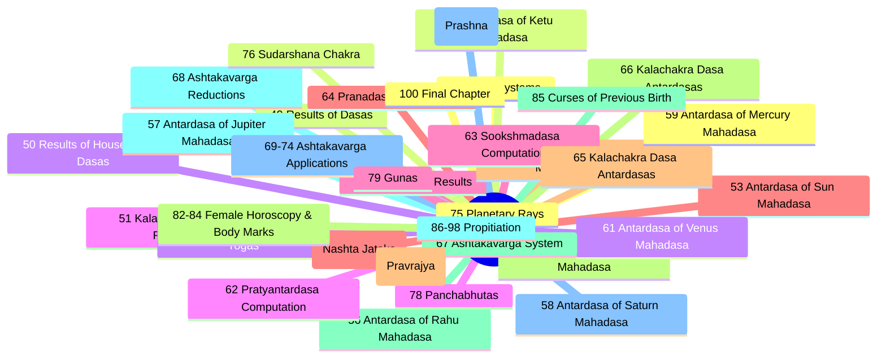
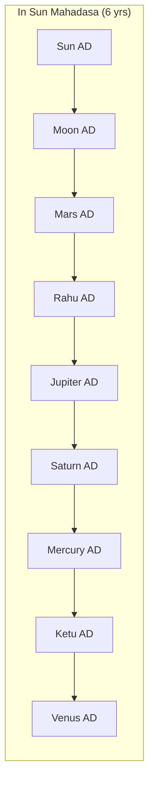
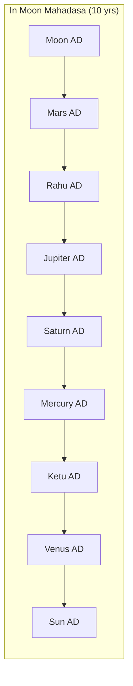

# Brihat Parasara Hora Sastra — Volume 2

> **Reference Guide for Chapters 48–100**  
> Girish Chand Sharma translation  
> Compiled from extracted text and chapter structure

---

## Volume Structure



---

## 48. Dasa Systems (pp. 1–110)

### 32 Types of Dasa Systems (Table-1)

> Maharishi Parasara enumerates 32 Dasa systems. Vimshottari is declared the prime system for Kali Yuga, having a full span of 120 years.

| # | Dasa System | Sanskrit | Type / Basis |
|---|-------------|----------|--------------|
| 1 | **Vimshottari** | f\x44r | Nakshatra-based, 120 yrs |
| 2 | Astottari | aera | Nakshatra-based, 108 yrs |
| 3 | Shodsottari | ed | Nakshatra-based |
| 4 | Dwadashottari | aravitra | Nakshatra-based |
| 5 | Panchottari | fant | Nakshatra-based |
| 6 | Shatabdika | were | Nakshatra-based |
| 7 | Chaturashitisama | agate | Nakshatra-based |
| 8 | Dwisaptatisama | Raat wn | Nakshatra-based |
| 9 | Shashtihayani | sfserrt | Nakshatra-based |
| 10 | Shatrimshatsama | wePaaea | Nakshatra-based |
| 11 | Kala | #1 | Temporal |
| 12 | Chakra | am | Zodiacal cycle |
| 13 | Kalachakra | — | Nakshatra-quarter based |
| 14 | Chara | — | Movable sign Dasa |
| 15 | Sthira | — | Fixed-period sign Dasa |
| 16 | Brahma-Graha | ems | Based on Brahma-Graha planet |
| 17 | Yogardha | ant | Half of Chara + Sthira |
| 18 | Kendradi | ie | Angular-house Dasa |
| 19 | Karaka | — | Based on 8 Karakas |
| 20 | Mandooka | avgat | Frog-leap Dasa (skip 2 signs) |
| 21 | Shoola | ¢ | Death-timing Dasa |
| 22 | Trikona | Prt | Trinal-house Dasa |
| 23 | Driga | g | Aspect-based Dasa |
| 24 | Rashi | awh | Sign-based Dasa |
| 25 | Panchswara | — | Five vowel sounds |
| 26 | Yogini | — | 8 Yoginis, 1–8 yr periods |
| 27 | Pinda Amsa | — | Based on Pinda (total) |
| 28 | Naisargika | — | Natural periods |
| 29 | Ashtakavarga | — | Based on Ashtakavarga bindus |
| 30 | Sandhya | — | Twilight Dasa |
| 31 | Pachaka | — | Digestive/processing Dasa |
| 32 | Tara | — | Nakshatra Tara-based |

### Vimshottari Dasa — The Prime System

#### Dasa Lord Sequence

```
Sun → Moon → Mars → Rahu → Jupiter → Saturn → Mercury → Ketu → Venus
```

#### Nakshatra Lordship (Table-1A)

| Planet | Years | Nakshatra 1 | # | Nakshatra 2 | # | Nakshatra 3 | # |
|--------|-------|-------------|---|-------------|---|-------------|---|
| **Sun** | 6 | Kritika | 3 | Uttara Phalguni | 12 | Uttara Ashada | 21 |
| **Moon** | 10 | Rohini | 4 | Hasta | 13 | Sravana | 22 |
| **Mars** | 7 | Mrigsira | 5 | Chitra | 14 | Dhanista | 23 |
| **Rahu** | 18 | Ardra | 6 | Swati | 15 | Satabhisha | 24 |
| **Jupiter** | 16 | Punarvasu | 7 | Vishakha | 16 | Purva Bhadra | 25 |
| **Saturn** | 19 | Pushya | 8 | Anuradha | 17 | Uttara Bhadra | 26 |
| **Mercury** | 17 | Ashlesha | 9 | Jyestha | 18 | Revati | 27 |
| **Ketu** | 7 | Magha | 10 | Moola | 19 | Ashwini | 1 |
| **Venus** | 20 | Purva Phalguni | 11 | Purva Ashada | 20 | Bharani | 2 |

> Note: Purva = Poorva, Uttara = Uttara

#### Dasa Lord at Birth — Determination

1. Count Nakshatras from **Kritika** to the **birth Nakshatra** (both inclusive)
2. Divide this count by **9**
3. The **remainder** = Dasa lord, counting from Sun (1=Sun, 2=Moon, ..., 9=Venus)
4. If remainder = 0, it corresponds to Venus (the 9th planet)

**Example** (from text): Birth in **Dhanista** (23rd Nakshatra). Count from Kritika = 21. 21 ÷ 9 = 2 remainder 3 → 3rd from Sun = **Mars**. Mars Dasa operates at birth.

#### Balance of Dasa — Calculation

**Formula** (Shloka 16):

\[
\text{Elapsed portion of Dasa} = \frac{\text{Bhayaata} \times \text{Dasa years of planet}}{\text{Bhabhoga}}
\]

\[
\text{Balance of Dasa} = \text{Total Dasa years} - \text{Elapsed portion}
\]

Where:
- **Bhayaata** = expired (elapsed) period of the birth Nakshatra at birth time (in Ghatis/Palas)
- **Bhabhoga** = full duration of the birth Nakshatra (in Ghatis/Palas)

**Example 1** — Panchanga Method (Birth: 11/12 June 1981, 1:30 AM):

| Parameter | Value |
|-----------|-------|
| Birth Nakshatra | Hasta (4th quarter) |
| Birth at | 50 Gh. 45 Pal. |
| Bhayaata | 61 Gh. 13 Pal. = 3673 Pal. |
| Bhabhoga | 64 Gh. 44 Pal. = 3884 Pal. |
| Nakshatras Kritika→Hasta | 11 → 11÷9 remainder 2 → **Moon Dasa** (10 yrs) |
| Elapsed | (3673 × 10) ÷ 3884 = **9 yrs 5 mo 14 days** |
| **Balance** | 10 yrs − 9 yrs 5 mo 14 days = **6 mo 16 days** |

**Example 2** — Ephemeris Method (Birth: 15 Aug 1994, 4:30 PM, Lahiri Ephemeris):

| Step | Calculation |
|------|-------------|
| Moon longitude at 5:30 AM | Scorpio 8° 03' |
| Moon motion in 24 hrs | 14° 02' (842') |
| Time elapsed 5:30 AM→4:30 PM | 11 hrs (660') |
| Moon traversed by birth | (842 × 660) ÷ 1440 = **6° 26'** |
| Moon longitude at birth | Scorpio **14° 29'** |
| Nakshatra | **Anuradha** (lord: Saturn) in 4th quarter |
| Balance of Anuradha remaining | (16° 40' − 14° 29') = **2° 11' = 131'** |
| Total Nakshatra span | 13° 20' = **800'** |
| Balance of Saturn Dasa | (19 yrs × 131) ÷ 800 = **1120 days ≈ 3 yrs 1 mo 10 days** |

### Other Nakshatra-Based Dasa Systems

#### Astottari Dasa

- 108-year cycle (alternative to Vimshottari)
- Used when Vimshottari does not apply (certain conditions)

#### Shodsottari, Dwadashottari, Panchottari

- Shorter Nakshatra-based cycles with different year allocations

### Kalachakra Dasa

- Based on **Nakshatra quarters (padas)** — 108 quarters across 12 signs
- Two cycles: **Savya** (direct) and **Apsavya** (reverse)
- Signs divided into **Deha** (body) and **Jeeva** (soul) classifications
- Complex system with Savya/Apsavya chakra tables

### Chara Dasa (Movable Sign Dasa)

- Entirely personal to the native's chart
- Dasa years determined by **distance from a sign to its lord**
- Counting: **forward** for odd signs, **reverse** for even signs
- Years = number of signs traversed, plus proportional months/days from remaining degrees

**Example** (from text):
- Ascendant in Capricorn (even sign) 19° 04' 42"
- Saturn (lord) in Virgo 3° 16' 14"
- Difference: 4 signs, 15° 48' 29"
- **Dasa = 4 years, 6 months, 10 days** of Capricorn

### Sthira Dasa

| Sign Type | Dasa Years |
|-----------|-----------|
| Movable (Chara) | **7 years** |
| Fixed (Sthira) | **8 years** |
| Dual (Dwisvabhava) | **9 years** |

- Sequence begins from **Brahma-Graha** sign
- Odd sign → forward counting; Even sign → reverse counting

#### Brahma-Graha Determination

1. Determine stronger of **Ascendant** or **7th house**
2. Among 6th, 8th, 12th lords from that house, pick the strongest
3. Must be in an **odd sign** and within 6 signs of the stronger house
4. Lord of 8th from **Atmakaraka** also considered
5. Among Saturn, Rahu, Ketu — any picked as Brahma-Graha qualifies
6. Tie-breakers: higher longitude > natural strength (Sun > Moon > Venus > Jupiter > Mercury > Mars > Saturn)

### Yogardha Dasa

\[
\text{Yogardha Dasa years} = \frac{\text{Chara Dasa years} + \text{Sthira Dasa years}}{2}
\]

- Commences from stronger of Ascendant or 7th house
- Forward for odd signs, reverse for even signs

### Kendradi Dasa

- Sequence: **Kendra** (angles) → **Panaphara** (succedent) → **Apoklima** (cadent) signs
- Order based on comparative strength of signs
- Two subtypes: **Kendradi-Sign Dasa** and **Kendra-Planet Dasa**
- Dasa years calculated per **Chara Dasa** method
- For planets owning 2 signs, the sign yielding longer period is used

### Karaka Dasa

- Commences from **Atmakaraka**
- Sequence follows the 8 **Karaka** order (descending longitude)
- Dasa years = number of signs between Ascendant and the Karaka's sign
- If planet in Ascendant itself → **12 years**

### Mandooka (Trikoota) Dasa

| Sign Type | Years |
|-----------|-------|
| Movable | 7 (Parasara) |
| Fixed | 8 |
| Dual | 9 |
| All signs (Jaimini) | 9 |

- Named "Frog-leap" because every **two signs are skipped** in sequence
- 1st cycle: all 4 movable signs → 2nd cycle: all 4 fixed signs → 3rd cycle: all 4 dual signs

### Shoola Dasa (Niryana Shoola)

- For determining **timing of death**
- Starts from **8th house** from stronger of Ascendant/7th house
- Forward for odd signs, reverse for even signs
- Years = Sthira Dasa system
- Death likely in **strong Capricorn sign Dasa**

### Trikona Dasa

- Limited to **trinal houses** (1st, 5th, 9th)
- Commences from strongest among the three trines
- Dasa years = difference between trinal sign and its lord (like Chara)
- Three cycles of 4 signs each

### Driga Dasa

- Based on **planetary aspects** between signs
- **9th sign** + signs it aspects → **10th sign** + signs it aspects → **11th sign** + signs it aspects
- Aspect rules:
  - **Movable** signs aspect all **Fixed** signs (skip adjacent)
  - **Fixed** signs aspect all **Movable** signs (skip adjacent movable)
  - **Dual** signs aspect all **Dual** signs (except itself)
- Forward count for movable, reverse for fixed; dual: even→forward, odd→reverse

### Lagnadi-Rasi Dasa

\[
\text{Expired longitude} = \frac{\text{Bhayaata} \times 12}{\text{Bhabhoga}} + \text{Ascendant longitude}
\]

- If sum > 12 signs, subtract 12
- Result determines first Dasa sign
- Sequence: forward for odd, reverse for even
- Sthira Dasa years applied

**Balance formula**: (Expired longitude × total years) ÷ 30 = expired period; subtract from total.

### Panchswara Dasa

- Based on **5 vowel sounds** (Swaras): a, i, u, e, o
- Varana (consonants) arranged in 6 rows × 5 columns
- Swara determined by first Varana of native's name
- Each Swara Dasa = **12 years**
- Antardasas of all 5 Swaras within each

### Yogini Dasa

| # | Yogini | Planet | Years |
|---|--------|--------|-------|
| 1 | Mangla | Moon | 1 |
| 2 | Pingala | Sun | 2 |
| 3 | Dhanya | Jupiter | 3 |
| 4 | Bhramari | Mars | 4 |
| 5 | Bhadrika | Mercury | 5 |
| 6 | Ulka | Saturn | 6 |
| 7 | Sidha | Venus | 7 |
| 8 | Sankata | Rahu | 8 |

**Determination**: (Birth Nakshatra number + 3) ÷ 8 → remainder = Yogini Dasa at birth

**Example**: Kritika (#3) + 3 = 6 → 6÷8 remainder 6 → **Ulka Dasa** (Saturn, 6 yrs)

Balance calculated using Bhayaata/Bhabhoga formula as in Vimshottari.

---

## 49. Results of Dasas (pp. 111–132)

### Vimshottari Mahadasa Results

#### Sun Mahadasa (6 years)

| Condition | Effects |
|-----------|---------|
| **Benefic** | Royal favour, fame, administrative power, respected by learned, gains from father |
| **Malefic** | Eye troubles, fevers, worries, conflicts with authorities, ego clashes |

#### Moon Mahadasa (10 years)

| Condition | Effects |
|-----------|---------|
| **Benefic** | Wealth, conveyances, domestic comforts, social respect, gains from mother |
| **Malefic** | Mental unrest, financial fluctuations, water-related fears, emotional instability |

#### Mars Mahadasa (7 years)

| Condition | Effects |
|-----------|---------|
| **Benefic** | Courage, victory over enemies, land/property gains, administrative authority |
| **Malefic** | Accidents, injuries, conflicts, fires, debts, surgeries, blood-related issues |

#### Rahu Mahadasa (18 years)

| Condition | Effects |
|-----------|---------|
| **Benefic** | High position, name/fame, foreign connections, political power, sudden wealth |
| **Malefic** | Poisoning, accidents, surgeries, legal troubles, addictions, snake-related fears, scandals |

#### Jupiter Mahadasa (16 years)

| Condition | Effects |
|-----------|---------|
| **Benefic** | Wisdom, wealth, progeny, spiritual growth, royal recognition, religious pursuits |
| **Malefic** | Over-optimism, financial extravagance, son's troubles, dogmatic tendencies |

#### Saturn Mahadasa (19 years)

| Condition | Effects |
|-----------|---------|
| **Benefic** | Discipline, wealth through hard work, authority, land/property, longevity |
| **Malefic** | Delays, chronic diseases, poverty, isolation, servant-like work, depression |

#### Mercury Mahadasa (17 years)

| Condition | Effects |
|-----------|---------|
| **Benefic** | Education, business gains, communication skills, intellectual growth, literary success |
| **Malefic** | Nervous disorders, business losses, deception, skin issues, speech problems |

#### Ketu Mahadasa (7 years)

| Condition | Effects |
|-----------|---------|
| **Benefic** | Spiritual advancement, detachment, research, occult knowledge, philosophical insight |
| **Malefic** | Confusion, accidents, mysterious diseases, isolation, theft, aimlessness |

#### Venus Mahadasa (20 years)

| Condition | Effects |
|-----------|---------|
| **Benefic** | Luxury, marriage, vehicles, arts, romance, wealth accumulation, social success |
| **Malefic** | Excesses, relationship issues, venereal diseases, eye troubles, laziness |

---

## 50–52. Dasa of Lords of Houses / Kalachakra / Chara

### General Principle

Results of any Dasa depend on:
1. Which **house** the Dasa lord rules (or is placed in)
2. The lord's **strength** (exaltation, moolatrikona, own sign, debilitation)
3. **Conjunctions** and **aspects** received
4. Relationship to the **Ascendant** and its lord
5. Whether the lord is **natural benefic** or **malefic**

### House-wise Results of Dasa Lords

| House Ruled | General Results in Dasa |
|-------------|------------------------|
| 1st (Lagna) | Personality, health, self-development |
| 2nd | Wealth, family, speech, eyesight |
| 3rd | Siblings, courage, communication, short travels |
| 4th | Mother, education, lands, vehicles, happiness |
| 5th | Children, intellect, mantras, speculation |
| 6th | Enemies, diseases, litigation, service |
| 7th | Spouse, partnerships, foreign travel, marriage |
| 8th | Longevity, occult, inheritance, obstacles |
| 9th | Fortune, father, dharma, long journeys, guru |
| 10th | Career, status, government, profession |
| 11th | Gains, income, fulfillment of desires |
| 12th | Expenses, foreign lands, liberation, sleep |

---

## 53–62. Antardasa Systems (pp. 133–401)

### Computation of Antardasa

**Sequence**: Same order as Mahadasa lords: Sun → Moon → Mars → Rahu → Jupiter → Saturn → Mercury → Ketu → Venus

\[
\text{Antardasa duration} = \frac{\text{Mahadasa years} \times \text{Antardasa planet's years}}{120}
\]

#### Antardasa Sequence within Each Mahadasa





*(All 9 Mahadasas have their 9 Antardasas following the same cyclic order)*

### Chapters 54–62: Antardasa Results

| Chapter | Mahadasa | Content |
|---------|----------|---------|
| 54 | **Sun** | All 9 ADs in Sun MD |
| 55 | **Moon** | All 9 ADs in Moon MD |
| 56 | **Mars** | All 9 ADs in Mars MD |
| 57 | **Rahu** | All 9 ADs in Rahu MD |
| 58 | **Jupiter** | All 9 ADs in Jupiter MD |
| 59 | **Saturn** | All 9 ADs in Saturn MD |
| 60 | **Mercury** | All 9 ADs in Mercury MD |
| 61 | **Ketu** | All 9 ADs in Ketu MD |
| 62 | **Venus** | All 9 ADs in Venus MD |

Examples from text:
- Ch. 59: Antardasa of Saturn in Saturn MD; Antardasa of Mercury in Saturn MD; Antardasa of Ketu in Saturn MD; etc.
- Ch. 60: Antardasa of Mercury in Mercury MD; Ketu in Mercury MD; Venus in Mercury MD; etc.
- Ch. 61: Ketu in Ketu MD; Venus in Ketu MD; Mars in Ketu MD; Rahu in Ketu MD; Jupiter in Ketu MD; Saturn in Ketu MD; Mercury in Ketu MD
- Ch. 62: Venus in Venus MD; Sun in Venus MD; Moon in Venus MD; Mars in Venus MD; Jupiter in Venus MD; Mercury in Venus MD

### General Antardasa Interpretation

- **Antardasa of the same planet as Mahadasa** (*e.g., Sun AD in Sun MD*): Intensifies the Mahadasa results; often brings culmination of the MD theme
- **Antardasa of a friend**: Smooth, beneficial results
- **Antardasa of an enemy**: Obstacles, delays, mixed results
- **Antardasa of a functional benefic placed well**: Peak period within the MD
- **Antardasa of a functional malefic**: Challenging phase within the MD

---

## 63. Computation of Pratyantardasa

**Pratyantardasa** = 3rd-level sub-period within an Antardasa

\[
\text{Pratyantardasa duration} = \frac{\text{Antardasa years} \times \text{Pratyantardasa planet's years}}{120}
\]

- Same cyclic sequence applies within each Antardasa
- Total of 81 Pratyantardasas per Mahadasa (9×9)

Examples from text:
- Pratyantardasa in Antardasa of Sun
- Pratyantardasa in Antardasa of Moon
- Pratyantardasa in Antardasa of Jupiter
- Pratyantardasa in Antardasa of Saturn
- Pratyantardasa in Antardasa of Mercury

---

## 64. Computation of Sookshmadasa

**Sookshmadasa** = 4th-level sub-period within a Pratyantardasa

\[
\text{Sookshmadasa duration} = \frac{\text{Pratyantardasa years} \times \text{Sookshma planet's years}}{120}
\]

- Further fine-grained division of time
- Total of 729 Sookshmadasas per Mahadasa (9×9×9)

---

## 65. Computation of Pranadasa

**Pranadasa** = 5th-level sub-period (measured in Ghatis/hours)

\[
\text{Pranadasa duration} = \frac{\text{Sookshmadasa years} \times \text{Prana planet's years}}{120}
\]

- Extremely fine division — measured in hours/minutes rather than years
- Used for precise event timing

---

## 66–67. Kalachakra Dasa Antardasas

- Antardasas within the **Kalachakra Dasa** system
- Based on Savya (direct) and Apsavya (reverse) Chakra cycles
- Results depend on:
  - The **sign** (Deha/Jeeva distinction)
  - **Nakshatra quarter** position
  - Whether the sign is in the **Savya** or **Apsavya** group

---

## 68–74. Ashtakavarga System (pp. 505–588)

### Purpose

A system of **benefic points (bindus/Rekhas)** and **malefic lines (Sthanas)** based on the mutual positions of planets, used to gauge strength, auspiciousness, and longevity.

### Key Terms

| Term | Meaning |
|------|---------|
| **Rekha (Bindu)** | Benefic dot — indicates auspicious position |
| **Sthana (Rekha)** | Vertical line — inauspicious position |
| **Karna** | The benefic dots or bindus |

### Planetary Ashtakavarga

Each planet has a specific number of Rekhas contributed by each planet placed in each house:

| Planet | Total Rekhas |
|--------|-------------|
| Sun | 48 |
| Moon | 49 |
| Mars | 39 |
| Mercury | 54 |
| Jupiter | 56 |
| Venus | 52 |
| Saturn | 39 |
| Ascendant | 45 |

### Reductions

#### Trikona Shodhana (Triangular Reduction)

- Reduces Ashtakavarga points based on **trinal relationships**
- Applied within each set of 3 signs forming a triangle (1-5-9, 2-6-10, 3-7-11, 4-8-12)
- Only the sign with the **highest bindus** in each triangle survives reduction

#### Ekadhipatya Shodhana

- Applied when **one planet owns 2 signs**
- Rekhas in the two signs owned by the same planet are compared — only the sign with more bindus retains its value

#### Pinda Shodhana

- Final reduction to find the **Shodya Pinda** (total benefic points after all reductions)
- Used for longevity determination

### Planet-Specific Meanings

| Planet's Ashtakavarga | Matters Indicated |
|-----------------------|-------------------|
| **Moon's** | Mother, house, village, emotional well-being |
| **Mars's** | Brothers, valour, courage, land |
| **Mercury's** | Family, friends, maternal uncle, education |
| **Jupiter's** | Knowledge, religion, children, wealth |
| **Venus's** | Wife, wealth, marriage, property, comforts |
| **Saturn's** | Death, longevity, servants, sorrow |

### Longitude from Ashtakavarga

Each Rekha (benefic point) is assigned a specific number of years to determine the total longevity of the native.

### Samudaya Ashtakavarga (Collective)

- **Total** of all planetary Ashtakavargas combined (including Ascendant)
- Used for determining auspiciousness of:
  - **Muhurta** (electional times)
  - **Travel**
  - **Marriage**
  - **Other life events**

---

## 75. Planetary Rays (pp. 589–601)

### Rays at Deep Exaltation Point

| Planet | Units of Rays | Deep Exaltation Sign |
|--------|--------------|---------------------|
| Sun | — | Aries 10° |
| Moon | — | Taurus 3° |
| Mars | — | Capricorn 28° |
| Mercury | — | Virgo 15° |
| Jupiter | — | Cancer 5° |
| Venus | — | Pisces 27° |
| Saturn | — | Libra 20° |

*(Actual Ray values derived from degrees traversed in exaltation — total refined based on planetary positions)*

### Total Ray Computation

1. Each planet's Ray units assigned based on its **deep exaltation degree**
2. Adjustments made based on the planet's **actual longitude**
3. **Refinements** applied for retrogression, combustion, directional strength
4. Total rays used to assess **overall strength** of the horoscope

---

## 76. Sudarshana Chakra (pp. 602–618)

### Structure

| Level | Period |
|-------|--------|
| **Yearly Dasas** | 1 year each |
| **Monthly Antardasas** | Within each yearly Dasa |
| **2.5-day Pratyantar Dasas** | Within each monthly Antardasa |

### Cycle

- 12-year cycle based on signs
- Each sign's Dasa follows in natural order (or reverse for even Ascendant)
- Results judged by:
  - The **sign** lord's strength
  - The **house** the sign occupies
  - Planets **posited** in or **aspecting** the sign

### Interpretation

Sudarshana Chakra provides a **macro-to-micro** view:
- **Yearly**: Broad themes
- **Monthly**: Refinement of themes
- **2.5-day**: Immediate events

---

## 77. Panchamahapurusha Yogas (pp. 619–634)

### The Five Royal Yogas

| Yoga | Planet | Condition | Result |
|------|--------|-----------|--------|
| **Ruchaka** | Mars | In own/exaltation sign in a **Kendra** (1, 4, 7, 10) | Valorous, leader, wealthy, commanding |
| **Bhadra** | Mercury | In own/exaltation in a **Kendra** | Learned, eloquent, intelligent, witty |
| **Hamsa** | Jupiter | In own/exaltation in a **Kendra** | Wise, spiritual, royal, compassionate |
| **Malavya** | Venus | In own/exaltation in a **Kendra** | Luxurious, artistic, charming, beautiful |
| **Sasa** | Saturn | In own/exaltation in a **Kendra** | Authoritative, disciplined, powerful, long-lived |

### Qualifying Conditions

1. The planet must be in its **own sign** or **exaltation sign**
2. The planet must occupy a **Kendra** (angular house: 1, 4, 7, or 10)
3. Stronger the Kendra position, more powerful the yoga

---

## 78–79. Panchabhutas & Gunas

### The Five Elements (Panchabhuta)

| Element | Sanskrit | Planets | Temperament |
|---------|----------|---------|-------------|
| **Fire** | Agni | Sun, Mars | Energetic, aggressive, transformative |
| **Earth** | Prithvi | Mercury | Practical, stable, grounded |
| **Ether** | Akasha | Jupiter | Spiritual, expansive, all-pervading |
| **Water** | Jala | Moon, Venus | Emotional, nurturing, receptive |
| **Air** | Vayu | Saturn | Intellectual, detached, mobile |

### The Three Gunas

| Guna | Nature | Planets | Characteristics |
|------|--------|---------|----------------|
| **Sattwa** | Best | Jupiter, Venus, Mercury (when unafflicted) | Spiritual, wise, balanced, pure |
| **Rajas** | Moderate | Sun, Moon, Mars | Active, passionate, ambitious, dynamic |
| **Tamas** | Worst | Saturn, Rahu, Ketu | Lazy, cruel, ignorant, dull |
| **Udaseena** | Neutral | — | Indifferent, balanced between all |

### Application

- **Sattwik planets** in Kendra: spiritual inclination, wisdom
- **Rajasic planets** in Kendra: worldly success, ambition
- **Tamasic planets** in Kendra: obstacles, suffering
- The dominant Guna in the chart shapes the native's overall temperament

---

## 80. Lost Horoscopy (Nashta Jataka, pp. 655+)

### Purpose

When birth details are unknown, erect a chart from **question time** (Prashna):

1. Note the time and place of the query
2. Erect the horoscope for that moment
3. Apply specific rules to determine:
   - **Birth Ascendant**
   - **Planetary positions at birth**
   - **Approximate birth time**
4. Special considerations:
   - Use of **Tithi**, **Nakshatra**, **Vara**, **Karana** at query time
   - Strength of **Lagna** at query time
   - **Moon's position** as key indicator

---

## 81. Asceticism Yogas (Pravrajya Yogas)

### Yogas Causing Renunciation

Yogas arise from:
- **Ketu** in Kendra or Trikona with strong influence
- **Saturn** and **Rahu** in certain combinations
- **Sun** in debilitation with specific planetary combinations
- Lords of 4th, 8th, 12th houses forming connections
- **Moon** in specific Nakshatras (Moola, Jyestha, Ashlesha, etc.)
- Benefics in **6th, 8th, 12th** houses

---

## 82–84. Female Horoscopy & Body Marks (pp. 666–689+)

### Female Horoscopy

| Factor | Significance |
|--------|-------------|
| **7th house** | Marriage, husband, conjugal happiness |
| **8th house** | Longevity of spouse, widowhood potential |
| **Ascendant vs Moon** | Results judged from **stronger of the two** |
| **Trimsamsa (D-30)** | Feminine characteristics, inherent nature |

### Specific Yogas

| Condition | Indication |
|-----------|------------|
| Afflicted 5th house | Barrenness, issues with childbearing |
| Afflicted 7th house | Widowhood, marital problems |
| Visha Kanya Yoga | "Poison maiden" — harmful to husband |
| Specific planetary combinations | Lesbianism |
| Strong Venus + Jupiter | Beautiful features, happy married life |

### Auspicious Body Marks

| Mark | Significance |
|------|-------------|
| **Conch (Shankha)** | Auspicious, royal |
| **Swastika** | Auspicious, protective |
| **Chakra (Discus)** | Powerful, authoritative |
| **Lotus (Padma)** | Pure, beautiful, fortunate |
| **Fish (Matsya)** | Wealth, prosperity |
| **Elephant goad (Ankusha)** | Control, authority |

### Inauspicious Body Marks

- Absence of hair on specific body parts
- Certain moles on forehead, chest, back
- Crooked teeth or deformed fingers

---

## 85. Curses of Previous Birth

### Yogas of Childlessness

Attributed to **curses of previous birth** from:

| Source of Curse | Propitiatory Measure |
|-----------------|---------------------|
| **Serpents (Naga)** | Naga Puja, feeding Brahmins |
| **Forefathers (Pitris)** | Shraddha ceremony, Pitri Tarpan |
| **Mother** | Mother's worship, charitable acts |
| **Brother** | Brotherhood rituals, helping siblings |
| **Maternal Uncle** | Respect to maternal relatives |
| **Brahmins** | Brahmin feeding, daan (charity) |
| **Wife** | Marital harmony rituals |
| **Departed spirits (Pretas)** | Preta Shanti, specific homas |

---

## 86–98. Propitiation (pp. 739–778)

### Planetary Afflictions

#### Upaya (Remedial Measures) by Planet

| Planet | Idol Characteristics | Mantra Recitations | Havan |
|--------|---------------------|-------------------|-------|
| **Sun** | Copper, red, lotus seat | Gayatri, Aditya Hridaya | Red flowers, wheat, honey |
| **Moon** | Crystal, white, pearl | Mahamrityunjaya | Rice, white sandal, milk |
| **Mars** | Red sandal, red gem | Mantra 10,000 times | Red lentils, red flowers |
| **Mercury** | Gold, green | Mantra 9,000 times | Green lentils, grass |
| **Jupiter** | Gold, yellow, topaz | Mantra 19,000 times | Chickpeas, turmeric, ghee |
| **Venus** | Silver, white, diamond | Mantra 16,000 times | White rice, white sandal |
| **Saturn** | Iron, blue, black | Mantra 23,000 times | Black sesame, oil, iron |
| **Rahu** | Mixed metal, smoky quartz | Mantra 18,000 times | Coconut, blue cloth |
| **Ketu** | Palm leaf, red | Mantra 7,000 times | Red sandal, blanket |

### Inauspicious Births

| Birth Condition | Effect | Propitiation |
|----------------|--------|-------------|
| **Amavasya (New Moon)** | Weak mind, poverty | Chandra Daan, water offerings |
| **Krishna Chaturdashi** | Poverty, misery | Shiva Puja, fasting |
| **Bhadra Yoga** | Accidents, obstacles | Ganesha Puja, chanting |
| **Eclipse birth** | Social stigma | Grahana Shanti |
| **Sankranti (Solar ingress)** | Unstable mind | Surya Puja |

### Planetary Worship Methods

- **Yajnas** (fire ceremonies) with specific offerings
- **Deity worship** (appropriate deities: Surya for Sun, Chandra for Moon, etc.)
- **Mantra recitations** (specific counts for each planet)
- **Homa** (sacred fire offerings with prescribed materials)
- **Daan** (charity of specific items)
- **Fasting** on specific days
- **Gemstone** recommendations

---

## 99. Horary System (Prashna, pp. 779–793)

### General Principles

- Judgment made from the **query chart** (erected for the moment of question)
- Houses classified by query type

### Classification of Queries

| Category | Nature |
|----------|--------|
| **Dhatu** | Material/mineral queries (metals, gems, excavation) |
| **Jeeva** | Living being queries (birth, health, animals) |
| **Moola** | Plant/agricultural queries (crops, gardens) |

### House-wise Query Meanings

| House | Query Type |
|-------|------------|
| 1st | Self, health, general well-being |
| 2nd | Wealth, lost items |
| 3rd | Short journeys, siblings, courage |
| 4th | Lands, houses, mother |
| 5th | Children, intelligence, speculation |
| 6th | Enemies, diseases, service |
| 7th | Marriage, partnerships, travel |
| 8th | Death, inheritance, occult |
| 9th | Fortune, pilgrimage, father |
| 10th | Career, profession |
| 11th | Gains, fulfillment |
| 12th | Expenses, foreign travel |

### Deceitful / Misleading Queries

- Indicated by afflicted **7th house** or its lord
- **Mercury** connected with 7th house
- **Dual signs** on Ascendant or 7th
- **Retrograde** planets in specific houses

### Success / Failure Determination

- **Strong 1st, 6th, 11th houses**: Success
- **Strong 2nd, 8th, 12th**: Indecision or failure
- **Moon's** strength and aspects critical

---

## 100. Final Chapter

*(Closing chapter containing concluding remarks, summarization of key principles, and final instructions for complete astrological analysis based on the entire text.)*

---

## Appendix: Nakshatra Reference

| # | Nakshatra | Lord | Quarter 1 | Quarter 2 | Quarter 3 | Quarter 4 |
|---|-----------|------|-----------|-----------|-----------|-----------|
| 1 | Ashwini | Ketu | Aries 0°–3°20' | Aries 3°20'–6°40' | Aries 6°40'–10° | Aries 10°–13°20' |
| 2 | Bharani | Venus | Aries 13°20'–16°40' | Aries 16°40'–20° | Aries 20°–23°20' | Aries 23°20'–26°40' |
| 3 | Kritika | Sun | Aries 26°40'–30° | Taurus 0°–3°20' | Taurus 3°20'–6°40' | Taurus 6°40'–10° |
| 4 | Rohini | Moon | Taurus 10°–13°20' | Taurus 13°20'–16°40' | Taurus 16°40'–20° | Taurus 20°–23°20' |
| 5 | Mrigsira | Mars | Taurus 23°20'–26°40' | Taurus 26°40'–30° | Gemini 0°–3°20' | Gemini 3°20'–6°40' |
| 6 | Ardra | Rahu | Gemini 6°40'–10° | Gemini 10°–13°20' | Gemini 13°20'–16°40' | Gemini 16°40'–20° |
| 7 | Punarvasu | Jupiter | Gemini 20°–23°20' | Gemini 23°20'–26°40' | Gemini 26°40'–30° | Cancer 0°–3°20' |
| 8 | Pushya | Saturn | Cancer 3°20'–6°40' | Cancer 6°40'–10° | Cancer 10°–13°20' | Cancer 13°20'–16°40' |
| 9 | Ashlesha | Mercury | Cancer 16°40'–20° | Cancer 20°–23°20' | Cancer 23°20'–26°40' | Cancer 26°40'–30° |
| 10 | Magha | Ketu | Leo 0°–3°20' | Leo 3°20'–6°40' | Leo 6°40'–10° | Leo 10°–13°20' |
| 11 | Purva Phalguni | Venus | Leo 13°20'–16°40' | Leo 16°40'–20° | Leo 20°–23°20' | Leo 23°20'–26°40' |
| 12 | Uttara Phalguni | Sun | Leo 26°40'–30° | Virgo 0°–3°20' | Virgo 3°20'–6°40' | Virgo 6°40'–10° |
| 13 | Hasta | Moon | Virgo 10°–13°20' | Virgo 13°20'–16°40' | Virgo 16°40'–20° | Virgo 20°–23°20' |
| 14 | Chitra | Mars | Virgo 23°20'–26°40' | Virgo 26°40'–30° | Libra 0°–3°20' | Libra 3°20'–6°40' |
| 15 | Swati | Rahu | Libra 6°40'–10° | Libra 10°–13°20' | Libra 13°20'–16°40' | Libra 16°40'–20° |
| 16 | Vishakha | Jupiter | Libra 20°–23°20' | Libra 23°20'–26°40' | Libra 26°40'–30° | Scorpio 0°–3°20' |
| 17 | Anuradha | Saturn | Scorpio 3°20'–6°40' | Scorpio 6°40'–10° | Scorpio 10°–13°20' | Scorpio 13°20'–16°40' |
| 18 | Jyestha | Mercury | Scorpio 16°40'–20° | Scorpio 20°–23°20' | Scorpio 23°20'–26°40' | Scorpio 26°40'–30° |
| 19 | Moola | Ketu | Sagittarius 0°–3°20' | Sagittarius 3°20'–6°40' | Sagittarius 6°40'–10° | Sagittarius 10°–13°20' |
| 20 | Purva Ashada | Venus | Sagittarius 13°20'–16°40' | Sagittarius 16°40'–20° | Sagittarius 20°–23°20' | Sagittarius 23°20'–26°40' |
| 21 | Uttara Ashada | Sun | Sagittarius 26°40'–30° | Capricorn 0°–3°20' | Capricorn 3°20'–6°40' | Capricorn 6°40'–10° |
| 22 | Sravana | Moon | Capricorn 10°–13°20' | Capricorn 13°20'–16°40' | Capricorn 16°40'–20° | Capricorn 20°–23°20' |
| 23 | Dhanista | Mars | Capricorn 23°20'–26°40' | Capricorn 26°40'–30° | Aquarius 0°–3°20' | Aquarius 3°20'–6°40' |
| 24 | Satabhisha | Rahu | Aquarius 6°40'–10° | Aquarius 10°–13°20' | Aquarius 13°20'–16°40' | Aquarius 16°40'–20° |
| 25 | Purva Bhadra | Jupiter | Aquarius 20°–23°20' | Aquarius 23°20'–26°40' | Aquarius 26°40'–30° | Pisces 0°–3°20' |
| 26 | Uttara Bhadra | Saturn | Pisces 3°20'–6°40' | Pisces 6°40'–10° | Pisces 10°–13°20' | Pisces 13°20'–16°40' |
| 27 | Revati | Mercury | Pisces 16°40'–20° | Pisces 20°–23°20' | Pisces 23°20'–26°40' | Pisces 26°40'–30° |

---

## Appendix: Antardasa Duration Quick Reference Table (in years)

| MD → AD ↓ | Sun (6) | Moon (10) | Mars (7) | Rahu (18) | Jup (16) | Sat (19) | Merc (17) | Ketu (7) | Ven (20) |
|------------|---------|-----------|----------|-----------|----------|----------|-----------|----------|----------|
| **Sun (6)** | 0.300 | 0.500 | 0.350 | 0.900 | 0.800 | 0.950 | 0.850 | 0.350 | 1.000 |
| **Moon (10)** | 0.500 | 0.833 | 0.583 | 1.500 | 1.333 | 1.583 | 1.417 | 0.583 | 1.667 |
| **Mars (7)** | 0.350 | 0.583 | 0.408 | 1.050 | 0.933 | 1.108 | 0.992 | 0.408 | 1.167 |
| **Rahu (18)** | 0.900 | 1.500 | 1.050 | 2.700 | 2.400 | 2.850 | 2.550 | 1.050 | 3.000 |
| **Jupiter (16)** | 0.800 | 1.333 | 0.933 | 2.400 | 2.133 | 2.533 | 2.267 | 0.933 | 2.667 |
| **Saturn (19)** | 0.950 | 1.583 | 1.108 | 2.850 | 2.533 | 3.008 | 2.692 | 1.108 | 3.167 |
| **Mercury (17)** | 0.850 | 1.417 | 0.992 | 2.550 | 2.267 | 2.692 | 2.408 | 0.992 | 2.833 |
| **Ketu (7)** | 0.350 | 0.583 | 0.408 | 1.050 | 0.933 | 1.108 | 0.992 | 0.408 | 1.167 |
| **Venus (20)** | 1.000 | 1.667 | 1.167 | 3.000 | 2.667 | 3.167 | 2.833 | 1.167 | 3.333 |

> Formula: `(MD years × AD planet's years) ÷ 120`

---

*Compiled from Brihat Parasara Hora Sastra, Volume 2 — Translation by Girish Chand Sharma.*  
*Reference: Chapters 48–100 covering Dasa Systems, Ashtakavarga, Yogas, Horary, and Propitiation.*
